::::: titlepage
[Vietnam National University - HCMC]{.smallcaps}\
[University of Science]{.smallcaps}\
[Faculty of Information Technology]{.smallcaps}\

------------------------------------------------------------------------

\
**Mario Game Project Report**\

------------------------------------------------------------------------

\
**Course: CS202 -- Programming Systems**\

::: flushleft
*Students:*\

- Tran Minh Khoa -- 25125057

- Tran Nhu Khai -- 25125045

- Do Viet Hoang Long -- 25125024

- Tran Dang Khoa -- 25125056
:::

::: center

:::

August, 2026
:::::

# Abstract

The Mario Game Project is a two-dimensional platform game developed in
C++ using the SFML multimedia library. Inspired by classic
side-scrolling platformers, the project combines character movement,
combat, power-up transformations, enemy artificial intelligence,
collision detection, interactive environments, and level progression
within a custom game architecture. Players can choose from multiple
heroes---including Mario, Luigi, and Flash---each with distinct visual
styles and special abilities. The game implements several character
forms, collectible items, destructible blocks, projectile mechanics,
pipe travel, configurable audio, HUD management, and specialized enemies
such as Goomba, Koopa, Witch, and the multi-phase boss. Object-oriented
design principles and behavioral patterns are used to separate game
states, character forms, animations, physics, interactions, and level
management. The project also introduces JSON-based save and load
functionality for retaining essential gameplay progress. Overall, the
system demonstrates how modular software design can support an
extensible platform game while maintaining clear responsibilities
between gameplay, presentation, and data-management components.

# Introduction

Two-dimensional platform games provide a useful environment for studying
game development because they combine real-time input, animation,
physics, collision detection, artificial intelligence, resource
management, and user-interface design. Although their basic objective is
easy to understand, implementing a reliable platform game requires many
interconnected systems to operate consistently. Character movement must
respond smoothly to player input, collisions must be resolved without
allowing entities to pass through the environment, enemies must react
appropriately, and visual animations must remain synchronized with the
underlying gameplay state.

The Mario Game Project was developed as a custom C++ platform game
inspired by the mechanics of the Super Mario series. The game allows
players to control Mario, Luigi, or Flash. Each hero shares a common
movement and interaction framework while providing different textures,
animations, and projectile-based special abilities. Heroes can collect
mushrooms to enter a larger form and flowers to unlock an advanced form,
such as Fire Mario or ThunderFlash. Other gameplay elements include
collectible coins, temporary invincibility, interactive blocks, pipes,
environmental obstacles, and multiple enemy types.

A major objective of the project is to apply object-oriented programming
principles to a practical game system. Common entity behavior is
represented through inheritance and polymorphism, while specialized
classes implement the unique behavior of heroes, enemies, items, blocks,
and projectiles. Character forms and movement conditions are modeled
using separate form and state classes. This approach allows transitions
such as growing, shrinking, jumping, crouching, taking damage, and
celebrating victory to be managed without placing all behavior inside a
single character class. Factory classes are also used to create heroes,
enemies, blocks, and items from level data.

The project separates the gameplay world from presentation and
application-level state management. Dedicated systems handle physics,
entity interactions, level construction, runtime updates, animation,
sound, HUD information, menus, pause behavior, victory, defeat, and
transitions between screens. Levels are loaded from Tiled map files,
enabling terrain, triggers, enemy spawners, interactive objects, pipe
routes, and goal regions to be configured outside the source code. A
JSON-based save mechanism records important information such as the
active level, hero status, enemy data, modified blocks, score, coins,
lives, and remaining time.

This report presents the design and implementation of the Mario Game
Project, with particular attention to its software architecture,
gameplay systems, object-oriented design, enemy behavior, physics,
animation, user interface, and persistence mechanism. It also discusses
integration challenges encountered during development and identifies
areas for future improvement.

# Group Information

## Team Roles and Contributions

The project was developed collaboratively, with each member responsible
for a specific data structure or system component. In addition to their
core responsibilities, members also contributed to integration, testing,
and ensuring consistency across the system.

### Tran Minh Khoa

**Role:** Core Engine & Physics\
**Responsibilities:**

- Manage the SFML RenderWindow, Game Loop, and Game States.

- Implement precise AABB collision detection.

- Apply gravity and physics.

### Tran Nhu Khai

**Role:** Hero & Items Mechanics\
**Responsibilities:**

- Lead the project and design the initial workflow of the project.

- Build the base `Character` class and the `Mario` class (and other
  Character class).

- Implement classic items (Mushroom, Coin, Fire Flower) using the
  Factory Pattern.

### Do Viet Hoang Long

**Role:** Enemies & AI\
**Responsibilities:**

- Inherit the `Character` class to create the base `Enemy` abstract
  class.

- Create classic enemies (Goombas, Koopas).

- Implement standard patrol AI using the Template Method.

### Tran Dang Khoa

**Role:** Level, UI/UX & Audio\
**Responsibilities:**

- Build a Map Parser to load classic Mario levels from text/csv files.

- Implement the HUD (score, coins, lives) via the Observer Pattern.

- Develop a SoundManager for 8-bit BGM and SFX.

## Overall Contribution

The Mario game project was completed through close collaboration among
all team members, with each person taking responsibility for a major
gameplay system and then integrating their work into a unified project.
Tran Minh Khoa focused on the core engine and physics aspects, including
the render loop, collision handling, and gravity-based movement. Tran
Nhu Khai developed the main character and item mechanics, constructing
the base character hierarchy and implementing collectible items using a
factory-based design. Do Viet Hoang Long handled enemies and AI by
creating the enemy structure and basic patrol behaviors. Tran Dang Khoa
designed the level system, HUD, and sound management, enabling stage
loading, game status display, and audio feedback.

Across the whole project, all members participated in debugging,
testing, and refining the game to ensure stable gameplay, correct
interactions, and smooth project integration. This division of
responsibility allowed the team to build a complete and coherent
Mario-style game while maintaining code organization and reusability.

## Commit List (Git History) - brief version

It has been refined and condensed for easier reading compared to the
original text from `git log`.

Or on gitHub: 

# Project Design {#sec:project-design}

## Scope and Architectural Objectives

The Mario Game Project is a C++17, SFML-based two-dimensional
platformer. It supports three selectable heroes, three selectable
levels, data-driven Tiled maps, multiple hero forms, enemy AI, a
multi-phase boss, blocks and power-ups, hero and enemy projectiles,
sound, a HUD, pause/save/continue flows, and victory or defeat
transitions. The design has four primary objectives:

1.  keep application navigation separate from gameplay simulation;

2.  construct levels and entities from map or save data rather than in
    the main loop;

3.  represent behavior through polymorphism and composition so new
    characters, states, entities, and levels can be added locally; and

4.  make ownership explicit through RAII smart pointers, with narrow
    non-owning callbacks for cross-system events.

The implementation is organized into the `Core`, `Gameplay`, `Entities`,
`Managers`, and `Utilities` areas. SFML provides the window, events,
timing, graphics, views, textures, text, and audio. Tiled `.tmj` maps
are parsed with the vendored nlohmann JSON library.

## High-Level Architecture

At the highest level, `Game` runs a fixed-step application state stack.
`PlayingState` is the presentation-level controller for an active game,
while `LevelRuntime` is the gameplay facade. The latter owns the world
and delegates physical movement and entity interactions to dedicated
systems.

<figure id="fig:overall-architecture" data-latex-placement="htbp">
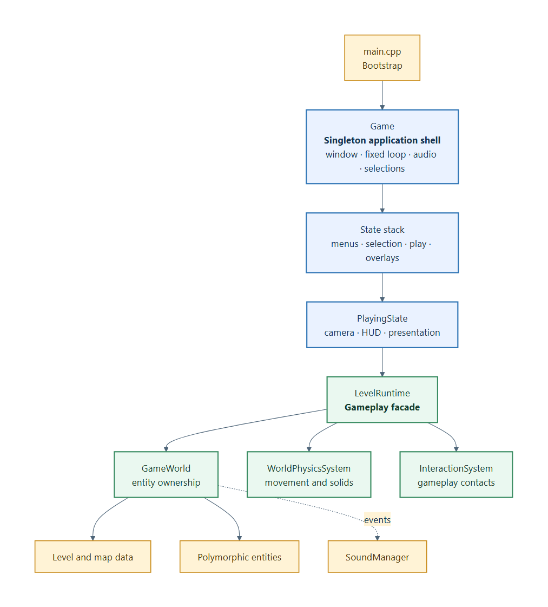
<figcaption>Layered runtime architecture of the game.</figcaption>
</figure>

  **Area**            **Main abstractions**                                                    **Responsibility**
  ------------------- ------------------------------------------------------------------------ ----------------------------------------------------------------------------------------------------------
  Application shell   `Game`, `State` and concrete screen states                               Window and fixed loop, event dispatch, screen navigation, overlays, global selection and audio lifetime.
  Gameplay facade     `PlayingState`, `LevelRuntime`                                           Camera/HUD and transitions on one side; ordered simulation and region/pipe behavior on the other.
  World and systems   `GameWorld`, `LevelBuilder`, `WorldPhysicsSystem`, `InteractionSystem`   Entity ownership, initial construction, terrain collision, entity-to-entity rules, and cleanup.
  Domain entities     Characters, blocks, items, projectiles, goals                            Polymorphic gameplay behavior and rendering.
  Data/services       Map, level, save, HUD and sound managers                                 Parse and render map data, persist sessions, display metrics, and play audio.
  Utilities           `Animator`, physics constants, shared Thunder Flash texture              Reusable animation, tuning constants, and lazy texture processing.

  : Primary architectural areas and responsibilities.

## Overall Class Diagram {#subsec:overall-class-diagram}

Figure [2](#fig:overall-class-diagram){reference-type="ref"
reference="fig:overall-class-diagram"} summarizes the main static
relationships across the complete project. The application layer owns
polymorphic screen states and long-lived services. The active
`PlayingState` owns one `LevelRuntime`, which acts as the facade over
world data, physics, and semantic interactions. `GameWorld` is the
aggregate root for live entities, while heroes and enemies delegate
their changing behavior to form and state objects. Builders and managers
remain outside the entity hierarchies so that construction, persistence,
and presentation do not become entity concerns.

<figure id="fig:overall-class-diagram" data-latex-placement="p">
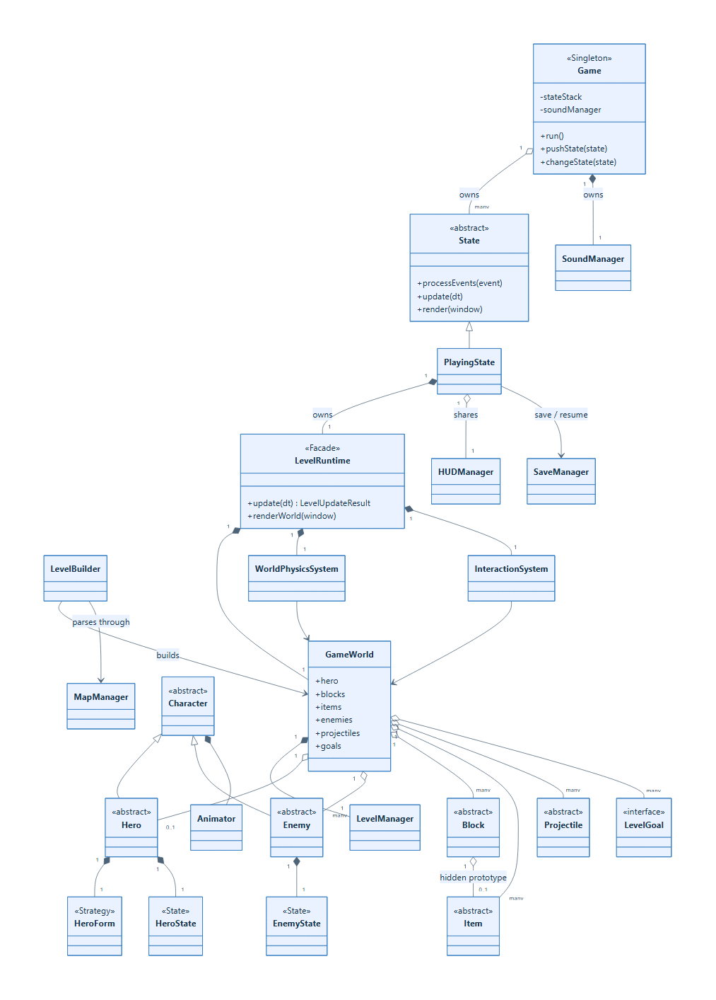
<figcaption>Overall class diagram of the application shell, gameplay
facade, world ownership, domain entities, and supporting
services.</figcaption>
</figure>

The diagram deliberately shows architectural classes and families rather
than every concrete subclass. The focused diagrams in the following
subsections expand the screen, hero, enemy, block, item, projectile,
goal, and service areas.

## Application Bootstrap, Main Loop, and State Stack

### Bootstrap and resource lifetime

`src/main.cpp` is intentionally small. It obtains the singleton `Game`,
queues a `MainMenuState`, and calls `run()`. `Game` owns the only
`sf::RenderWindow`, the state stack, the long-lived `SoundManager`,
selected hero and level metadata, and global volume settings. On
Windows, `main.cpp` also contains a compatibility definition for legacy
standard-I/O symbols required by the linked environment.

The loop uses a fixed simulation step of $1/60$ second and a variable
render rate. Elapsed wall time is clamped to $0.25$ seconds before it is
accumulated. This cap is important when a large map or texture takes
time to load: the game does not spend many seconds replaying accumulated
fixed updates after the load. Events are polled during fixed updates,
the active state is updated, and the visible portion of the state stack
is rendered once per outer loop iteration.

State transitions are deferred. A state may request Push, Pop, Replace,
or Clear-and-Push, but `Game::applyPendingStateAction` commits the
request outside the state's callback. This prevents deletion of a state
while its own event or update function is executing. Repeated Tab and
Enter key-press events are filtered until their key-release events,
preventing duplicate activations.

### Screen-state class diagram

<figure id="fig:screen-state-diagram" data-latex-placement="htbp">
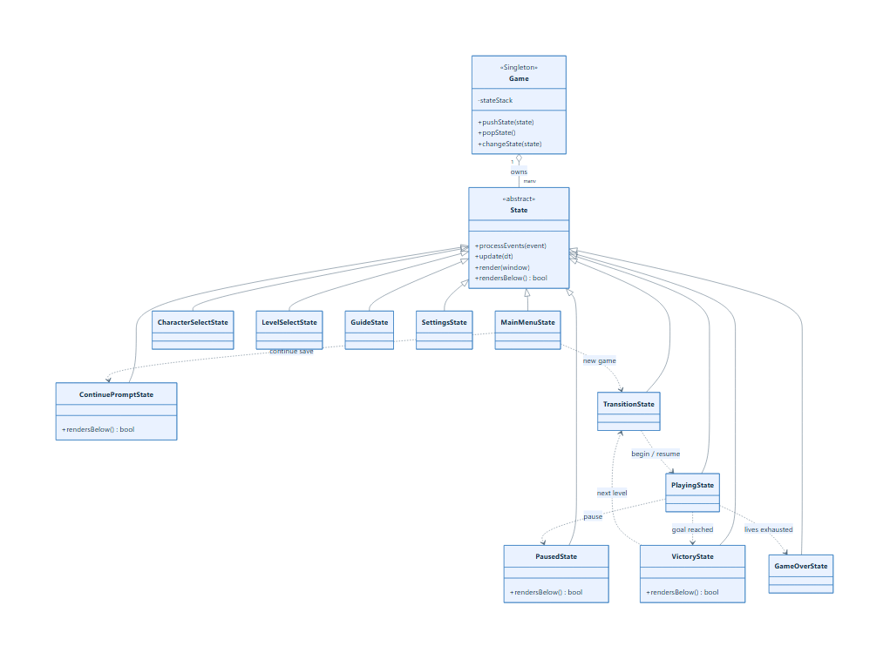
<figcaption>Application state hierarchy and principal navigation
paths.</figcaption>
</figure>

### Responsibilities of each screen

`MainMenuState`

:   Presents Play, Character, Level, Guide, and Settings buttons. Play
    opens `ContinuePromptState` if an existing save is found; otherwise
    it starts a transition directly. The menu also displays the
    currently selected world and starts menu background music.

`ContinuePromptState`

:   Is a modal overlay (`rendersBelow()` is true). It validates the
    save's map and tileset, resolves its catalog/world labels, and
    offers Continue or New Game. Continuing restores HUD metadata and
    enters `TransitionState` with a resume flag; New Game clears the
    stack and uses current selections.

`CharacterSelectState`

:   Displays Mario, Luigi, and Flash cards. Confirmation writes a
    `HeroType` into `Game` and returns to the menu. It does not
    construct the hero; construction is deferred until a level is built.

`LevelSelectState`

:   Builds its three cards from `LevelCatalog::LEVELS`. Levels 1, 2, and
    3 correspond to worlds 1-1, 1-2, and 1-3 and are currently marked
    `READY`. Confirmation stores the map path and world label in `Game`.

`GuideState`

:   Implements a paged help screen with character, item, and
    keyboard/control illustrations.

`SettingsState`

:   Owns two reusable slider records for BGM and SFX volume. Keyboard,
    mouse, hover, and drag operations update the global `Game` settings
    and therefore the live `SoundManager`.

`TransitionState`

:   Displays the selected world and remaining lives for two seconds,
    then replaces itself with `PlayingState`. A shared `HUDManager`
    survives retries and next-level transitions.

`PlayingState`

:   Owns camera and HUD presentation, one `LevelRuntime`, pause/save
    integration, level theme music, victory and defeat delays, and Thor
    King phase-three environmental effects.

`PausedState`

:   Is a modal overlay containing Resume, Save, and Main Menu commands.
    The Save command invokes a callback supplied by the underlying
    `PlayingState`; the pause state therefore does not need access to
    the complete world.

`VictoryState`

:   Is a modal animated overlay offering Replay, Main Menu, and Next
    Level. Next Level uses `LevelCatalog::nextAfter`, preserves the
    shared HUD, resets the timer, updates the selected level, and enters
    another transition.

`GameOverState`

:   Presents the defeat animation and returns to the menu when Enter is
    pressed.

This state hierarchy is preferable to a single screen-mode switch in the
main loop. Every screen owns only its own graphical controls and input
rules, while `Game` supplies one uniform lifetime and navigation
protocol.

## Gameplay Coordination and World Ownership

### Facade and subsystem boundaries

`PlayingState` is intentionally not the owner of entity collections. It
delegates them to `LevelRuntime`, which provides a facade over the
complete running level. `LevelRuntime` in turn owns `GameWorld`,
`WorldPhysicsSystem`, and `InteractionSystem`; it creates a short-lived
`LevelBuilder` for initial construction or reload.

<figure id="fig:gameplay-facade-diagram" data-latex-placement="htbp">
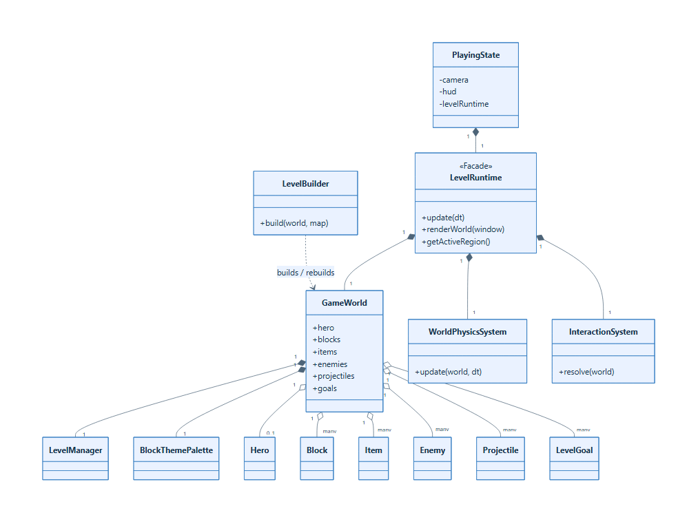
<figcaption>Gameplay facade, systems, and ownership.</figcaption>
</figure>

`GameWorld` is the aggregate root for live gameplay data. Its entity
collections use `std::unique_ptr`; consequently, an entity has exactly
one owner and is destroyed automatically when removed or when the world
is cleared. Systems receive a `GameWorld&` temporarily and never take
ownership. `SoundManager*` is explicitly non-owning because the audio
service belongs to `Game` and outlives every level.

`GameWorld::removeInactiveEntities` is the deferred cleanup point.
Entities mark themselves inactive, collected, or dead during update and
interaction passes; erasure occurs afterward, avoiding iterator
invalidation. For destroyed map blocks, the world also retains
tile-coordinate pairs used by persistence. The world exposes a
map-collider collection built from terrain tiles for compatibility,
while current high-frequency physics queries use the `LevelManager` tile
grid directly.

### Per-frame update order

The order of a frame is part of the game's behavior:

1.  `PlayingState` obtains a newly pressed pipe direction and calls
    `LevelRuntime::update`.

2.  The runtime snapshots the room-bottom boundary of each active enemy.
    This prevents an enemy falling from a vertically stacked room from
    being incorrectly reassigned to the room below.

3.  Intrinsic updates run in the order Hero, Blocks, Items, Enemies, and
    Projectiles. These updates handle input, state changes, animation,
    acceleration policy, timers, and spawning intent.

4.  `WorldPhysicsSystem` integrates velocity and resolves terrain and
    block collisions.

5.  `InteractionSystem` resolves cross-entity contacts and returns one
    score delta.

6.  The runtime enforces the live boss-arena boundary, attempts pipe
    travel, synchronizes the active region, applies hero/enemy fall
    deaths, culls out-of-world projectiles, and removes inactive
    entities.

7.  Back in `PlayingState`, score and coin changes are applied to the
    HUD; theme or invincibility music and the pixel-aligned camera are
    updated; then victory, time-out, defeat, and boss VFX are processed.

Victory becomes authoritative once a goal has activated. The hero enters
`CheerState`; after a short delay, a `VictoryState` overlay is pushed.
Defeat restores the score/coin/lives snapshot from the start of the
attempt, removes one life, plays the player-down cue, and after two
seconds either retries through `TransitionState` or enters
`GameOverState`.

### Rendering order

`PlayingState` installs the world camera and draws an underground black
backdrop when appropriate. `LevelRuntime::renderWorld` then draws the
tile-map mesh, blocks in the active region, items, hero, enemies, and
projectiles. Thor King phase-three overlays, lightning, fissures, and
debris are drawn by `PlayingState`. Finally, the HUD is drawn in the
default window view so it remains screen-relative, and the default view
is restored.

## Level and Map System

### Data model and loading pipeline

The level pipeline deliberately separates parsing, storage, rendering,
and gameplay construction.

<figure id="fig:level-pipeline-diagram" data-latex-placement="htbp">
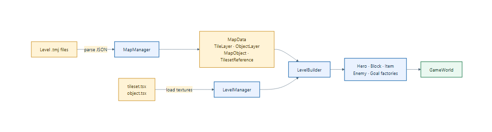
<figcaption>Data-driven level loading and construction
pipeline.</figcaption>
</figure>

`MapManager` parses map dimensions, tile size, tileset references,
visible tile layers, object layers, Tiled's modern `class` field with a
legacy `type` fallback, geometry, GIDs, and scalar custom properties.
`MapObject` retains all scalar properties in a string map and also
populates typed aliases such as target map, direction, contained item,
theme, and count. `MapData` provides layer lookup, class queries, map
pixel dimensions, and matching pipe exits.

`LevelManager` owns the parsed `MapData`, the main and optional object
textures, and one pair of `sf::VertexArray` meshes per visible tile
layer. At load time it resolves TSX image paths and converts all
non-empty tiles into texture-mapped quads. Main-atlas and object-atlas
quads are batched separately, which reduces per-frame draw work compared
with one sprite per tile. It also supplies tile ID, solid-at-tile/pixel,
interactive-tile, tile mutation, and flexible object-query operations.
Pixel art uses nearest-neighbor sampling and non-repeating textures to
prevent atlas bleeding.

### Level construction

`LevelBuilder::build` performs these steps:

1.  load the map and tilesets through `LevelManager`;

2.  create the callback through which heroes and enemies transfer new
    projectiles into `GameWorld`;

3.  find `Trigger/start` (with a legacy spawn fallback), create the
    selected hero through `HeroFactory`, and interpret the Tiled point
    as a foot-position anchor;

4.  create terrain rectangles for solid tiles;

5.  create Flag or Princess goal triggers from `Trigger/end`;

6.  translate `Interactive` objects into bricks, question blocks,
    invisible blocks, ground coins, or a fallback flag, using factories
    and contained-item properties;

7.  match platform-up/platform-down spawners to unique
    `platform_despawn` boundaries and construct `Lifter` platforms; and

8.  translate other `Spawner` objects into Goombas, Koopas, Witches, or
    Thor King. Boss sound events are connected to the audio service.

The construction code accepts selected legacy/case variants of object
classes, which protects existing maps during schema evolution. New map
schemas should prefer one canonical spelling to reduce string-based
branching.

### Playable regions, themes, pipes, and boss arena

`LevelRuntime` caches valid `Trigger/playable_region` rectangles. The
active region supplies the fall boundary, vertical camera anchor, block
theme, and block-render visibility. Direct movement may switch between
side-by-side regions with vertical overlap; vertically stacked rooms are
switched explicitly through pipe destinations so falling into a pit
cannot accidentally enter the room below. If no unique region contains
the hero, the runtime uses full map bounds and can infer a fallback
theme from a boss arena.

Pipe entrances are `pipe_in` triggers whose names match `pipe_out`
objects. Direction, hero alignment, grounded state, allowed movement
state, destination region, and a short cooldown are all checked. The
destination point is interpreted as center-X and feet-Y, which keeps
different hero forms aligned. The input direction is latched until
release so a held key does not immediately travel back through the exit.

Level 1-3 contains the current boss area. A `boss_arena` trigger gives
the arena metadata, and a boss spawner produces `ThorKing`. While the
boss is alive, the runtime clamps the hero against the configured arena
edge; the restriction disappears after the boss dies. The Princess goal
represents the final rescue endpoint.

### Current level catalogue

`LevelCatalog.h` is a compile-time catalogue containing the displayed
number, world name, readiness status, map path, transition title, and
compact HUD world label for each level. World 1-1 is an overworld with
an underground pipe room; world 1-2 is a larger multi-region level with
several paired pipes and moving lifters; world 1-3 is the boss level
with Witches, Thor King, and a Princess goal. The associated data files
are `assets/maps/levels/1-1.tmj`, `assets/maps/levels/1-2.tmj`, and
`assets/maps/levels/1-3.tmj`; shared Tiled definitions are
`assets/maps/resources/tileset.tsx` and
`assets/maps/resources/object.tsx`.

## Character and Hero System

### Base character abstraction

`Character` is the abstract root for heroes and enemies. It centralizes
position, velocity, hitbox shape, sprite, owned texture, animation
controller, life, facing direction, and grounded state. Its polymorphic
contract includes update, render, damage, interaction,
stomp/side-collision responses, speed, health, touch damage, score
value, and a stable type name. The common setters keep logical position,
hitbox, and sprite synchronized.

### Hero class diagram

<figure id="fig:hero-class-diagram" data-latex-placement="htbp">
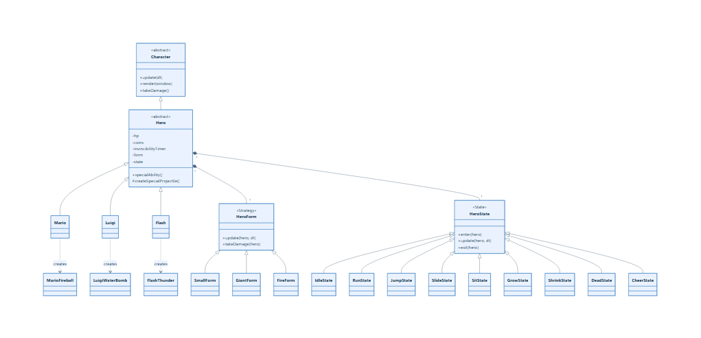
<figcaption>Character inheritance and the two orthogonal hero behavior
axes.</figcaption>
</figure>

`Hero` adds a form strategy, a movement state, base and special texture
paths, form-dependent sprite scales, override animation, invincibility
and Starman timers, coin and HP data, projectile spawning, and SFX
callbacks. `Hero::update` updates timers, synchronizes coordinates,
delegates to the form and state, and composes an animation key from form
plus state (for example, `GiantRun`). Override animation supports a
temporary special attack without replacing the movement state.

Damage is form-dependent. Small form dies, Giant form enters a Shrink
state, and Fire form first downgrades to Giant before using Giant's
shrink behavior. Invincibility frames prevent duplicate damage and
render as blinking; Starman invincibility uses color cycling and special
music. A falling hero who meets the top portion of an enemy invokes
`onStomped`, bounces upward, and returns the enemy's score; other
contact delegates to the enemy's side-collision policy.

### Concrete heroes and forms

`Mario`, `Luigi`, and `Flash` configure their own sprite sheets and
animation rectangles but share movement, form, and collision logic.
Their Factory Method creates different projectiles:

- Mario's special form uses `FireMario.png`, a two-second cooldown, a
  special sound, and a horizontally launched fireball.

- Luigi's special form uses `KitsuneLuigi.png`, a three-second cooldown,
  and an upward-thrown water bomb that creates a splash.

- Flash's special form uses a processed `thunderflash2.png`, a
  $2.5$-second cooldown, and a fast thunder strike. If the optional
  processed texture cannot be loaded, its animation table falls back to
  the base sheet.

A Mushroom only starts Small-to-Giant growth. A Flower is collectible
only by an already powered hero and changes Giant to Fire; therefore
Flash does not become Thunder Flash merely by eating a Mushroom. "Fire"
is the shared internal form name, although the visual and attack
semantics are hero-specific.

### Hero movement state machine

<figure id="fig:hero-state-machine" data-latex-placement="htbp">
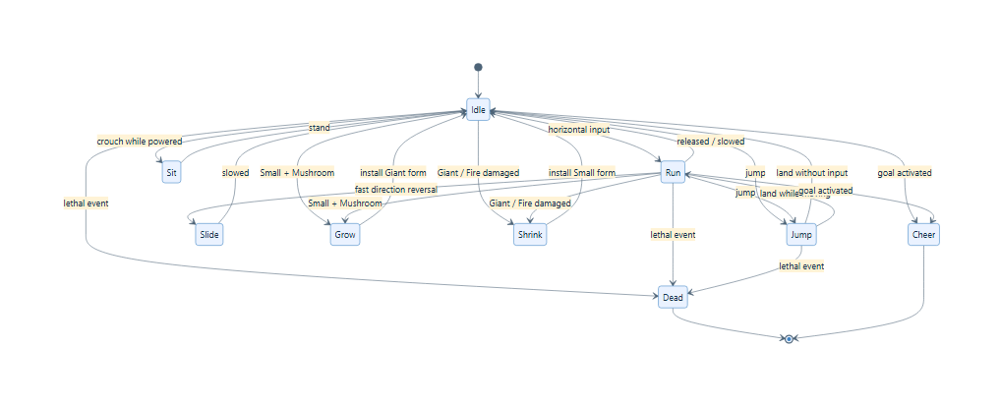
<figcaption>Principal transitions in the hero state
machine.</figcaption>
</figure>

Idle, Run, Jump, Slide, and Sit own input-sensitive motion. They use
values from `PhysicsConstants.h` for acceleration, friction, air
control, jump impulse, and fall speed. Grow and Shrink are timed
animation states. Sit temporarily changes a powered hero to a
$32\times48$ hitbox and restores the $32\times64$ standing hitbox on
exit. Dead owns defeat motion without terrain collision, and Cheer locks
velocity during level completion.

## Enemy and Boss System

### Enemy hierarchy and composition

<figure id="fig:enemy-class-diagram" data-latex-placement="htbp">
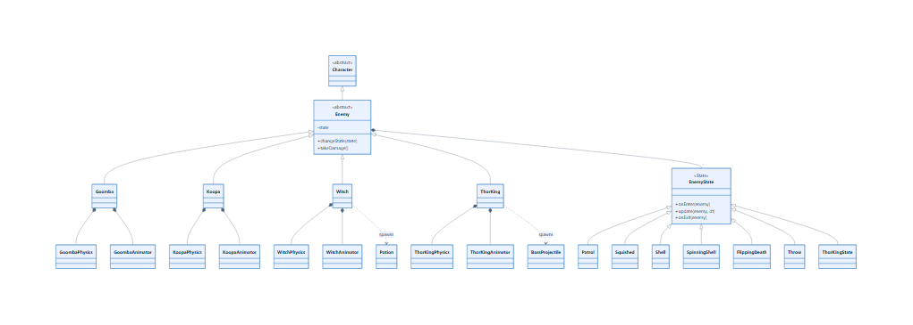
<figcaption>Enemy inheritance, AI states, and composed
helpers.</figcaption>
</figure>

`Enemy` supplies speed, health, patrol bounds, direction, sprite offset,
state timer, and the current `EnemyState`. Patrol behavior checks
bounds, moves, and animates. General collision responses damage the
other character or die when stomped, while subclasses refine those
rules.

`Goomba` delegates movement/contact details to `GoombaPhysics` and
visual state to `GoombaAnimator`; a stomp uses a timed squished state.
`Koopa` adds static and spinning shell modes, shell speed, wake timer,
kick cooldown, and shell-specific stomp and side-contact behavior.
Spinning shells can defeat other enemies through `InteractionSystem`.

`Witch` adds an attack cooldown and `ThrowState`. At the attack moment
it creates an enemy-faction `Potion` through its callback. A potion
follows gravity, becomes a wide temporary puddle on solid impact, and
can damage the hero during target interaction.

### Thor King boss

`ThorKing` has three HP-based phases, increasing roll/fire behavior,
wall-bounce counters, a shot sequence, and a phase-three sky-launch
cycle. Its AI states separate patrol, crouch, rolling shell, vulnerable
stun, fire attack, and phase-change roar. `ThorKingPhysics` owns boss
collision and damage transitions; `ThorKingAnimator` selects normal,
enraged, sky-meteor, and winged visual resources. The boss publishes
attack and defeat sound events and can spawn straight or sky-drop
attacks. Its core HP and counters are persisted, while transient AI
resumes from a safe patrol state on load.

This design keeps the general enemy contract usable by world systems.
The boss is still an `Enemy`, so ordinary rendering, ownership,
projectile target selection, cleanup, and score rules apply.
Boss-specific behavior is isolated to its class, helpers, AI states,
arena code, and visual effects.

## Blocks and Items

### Class diagram

<figure id="fig:block-item-diagram" data-latex-placement="htbp">
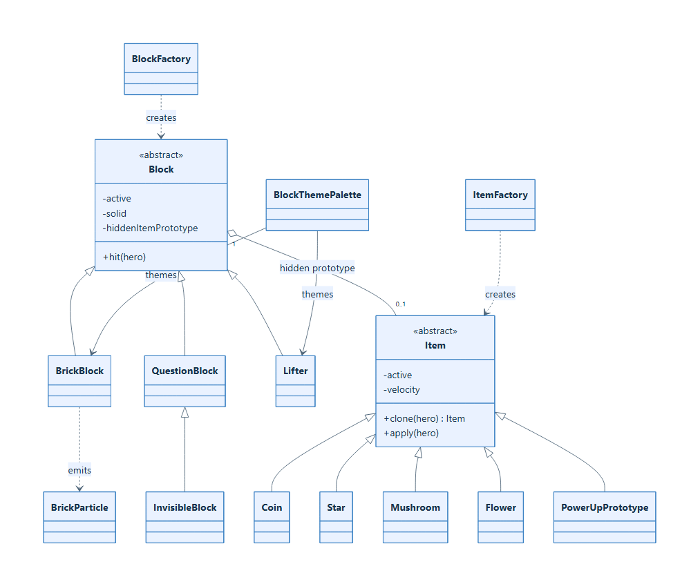
<figcaption>Block, hidden-item Prototype, and collectible
hierarchies.</figcaption>
</figure>

`Block` defines update, render, hit, lifetime, solidity, underside-hit
capability, and platform velocity. It may own an item prototype and
count. `QuestionBlock` animates until its final hidden item is released
and then displays its empty frame. `InvisibleBlock` derives from it but
is invisible and non-solid until hit from below. `BrickBlock` either
releases its hidden item or, for Giant/Fire heroes, becomes four locally
owned `BrickParticle` records before deactivation. `Lifter` is a
non-hittable solid platform that loops vertically between paired map
bounds and reports velocity so the physics system can carry a rider.

`BlockThemePalette` owns overworld, underground, and castle textures for
bricks and lifters. The active playable-region theme selects the current
texture, so the same block objects can render correctly after pipe
travel. Blocks cache the bound theme but resynchronize during
update/render.

`Item` defines spawning, cloning, collection, collision capability, and
movement data. A ground Coin remains until collected; a block Coin is
awarded when cloned and performs a short bounce visual. Mushroom emerges
and begins horizontal motion; Flower emerges without horizontal
movement; Star emerges and then bounces with temporary Starman
invincibility on collection. `PowerUpPrototype` chooses Mushroom or
Flower at release time. This separation lets Tiled specify content and
count while entity classes retain the actual gameplay effects.

## Projectile System

<figure id="fig:projectile-class-diagram" data-latex-placement="htbp">
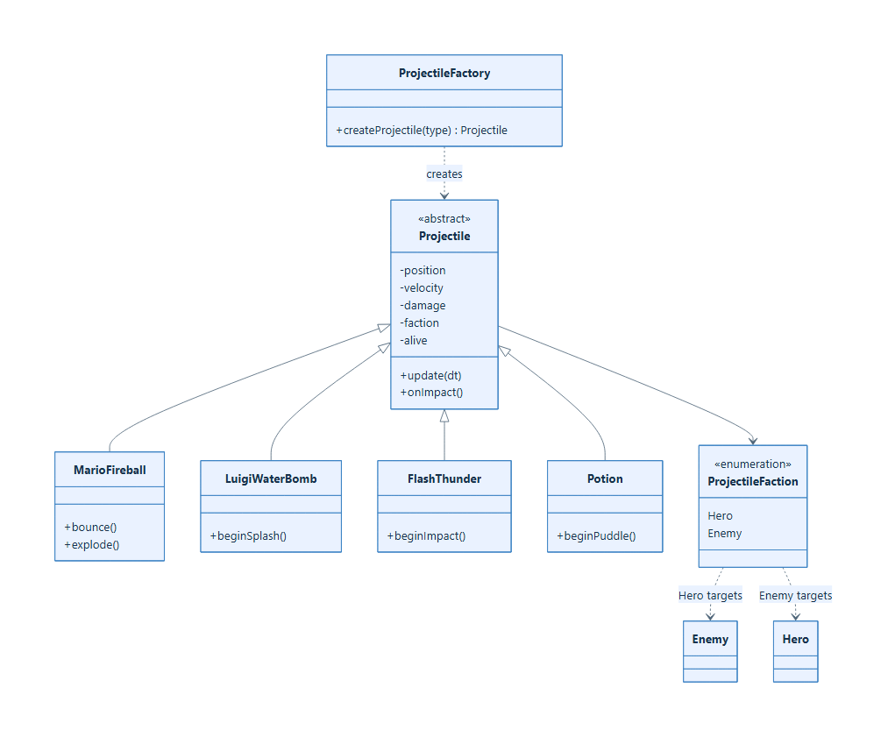
<figcaption>Unified projectile hierarchy and concrete phase
behavior.</figcaption>
</figure>

The abstract `Projectile` contract separates intrinsic behavior from
world integration. A projectile updates acceleration and phase timers,
while `WorldPhysicsSystem` integrates it only when `usesWorldPhysics()`
is true. On collision, the system calls the polymorphic
`onSolidCollision`; target damage is handled through `onHitTarget`.
`ProjectileFaction` prevents hero attacks from targeting the hero and
enemy attacks from targeting enemies.

`MarioFireball` follows gravity, bounces from floor contacts, and
explodes on walls or targets. `LuigiWaterBomb` follows a strong arc and
expands into a one-frame damage splash. `FlashThunder` travels without
gravity and expands into a pulsing impact strike. Both area attacks
retain a set of already-hit character addresses and close their damage
window after the interaction pass. `Potion` is the Witch's enemy
projectile and becomes a timed puddle. `ProjectileFactory` reconstructs
supported projectiles from save strings while restoring velocity and
faction.

## Physics and Interaction Systems

### Class relationships

<figure id="fig:physics-interaction-diagram"
data-latex-placement="htbp">
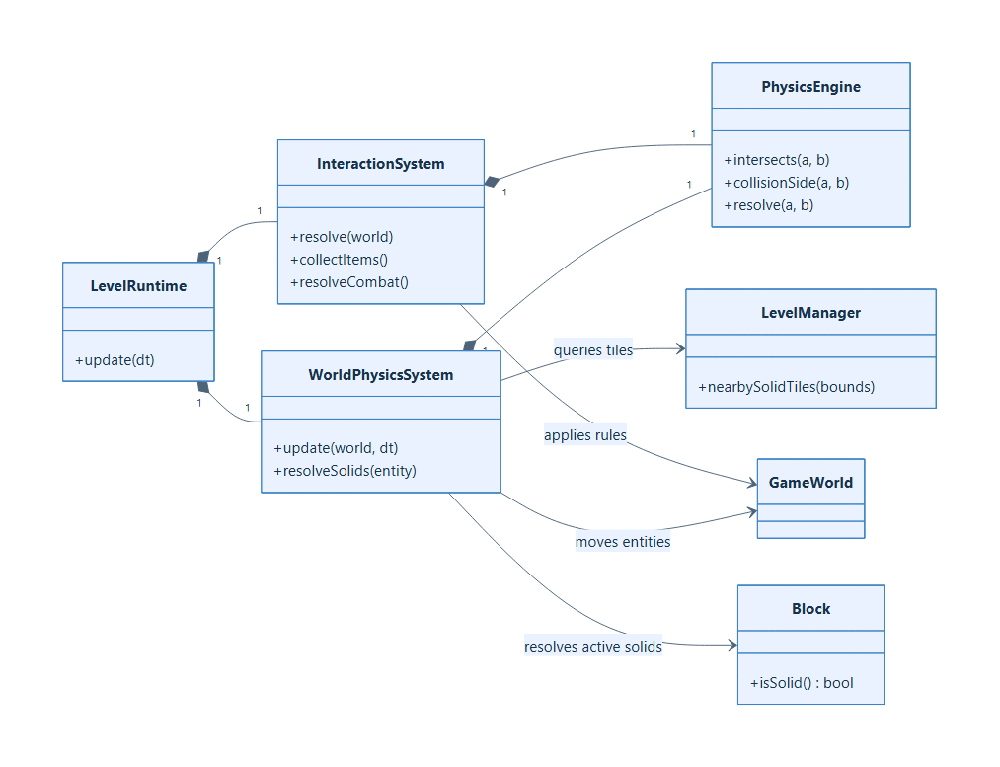
<figcaption>Separation between world collision and semantic
interaction.</figcaption>
</figure>

`PhysicsEngine` is the low-level axis-aligned bounding-box utility. It
applies gravity, classifies a contact as Top, Bottom, Left, Right, or
None, and resolves X or Y overlap for either `sf::RectangleShape` or
`sf::FloatRect` obstacles. `CollisionTypes.h` owns the shared `SideType`
enumeration.

`WorldPhysicsSystem` has four category-specific passes. Hero collision
uses swept previous/proposed bounds to prevent tunneling and to select
one deterministic ceiling or landing surface. It supports dynamic
blocks, hidden block hits, rider carry on downward lifters, grounded
state, and separate X/Y resolution. Items integrate their velocity, land
on solids, and reverse on horizontal contacts. Enemies receive gravity,
collide with nearby terrain and blocks, and notify or flip once on a
wall. Projectiles use their own gravity policy and receive a polymorphic
collision callback.

For performance, terrain collision enumerates only tile coordinates
touched by a swept query rectangle and asks
`LevelManager::isSolidAtTile`. It does not scan every solid rectangle in
a large level on every entity frame. Dynamic blocks remain a separate
vector because their state, visibility, and position can change.

`InteractionSystem` resolves semantic contacts in this order: hero-item,
spinning-shell/enemy, hero-enemy, projectile-target, and hero-goal. It
returns one accumulated score delta. Dead heroes and
defeated/transitional enemies are guarded consistently. Hero area
projectiles receive two target passes because the first hit may expand
their bounds; a per-frame set prevents resolving one enemy twice.

Keeping the two systems separate is a major design decision. A wall
collision changes geometry and velocity, while an item collection or
enemy stomp changes game semantics, score, audio, form, and lifetime.
Separating them makes the per-frame order visible and prevents one
monolithic collision routine from knowing every concrete entity type.

## Goal and Level-Completion System

<figure id="fig:goal-class-diagram" data-latex-placement="htbp">
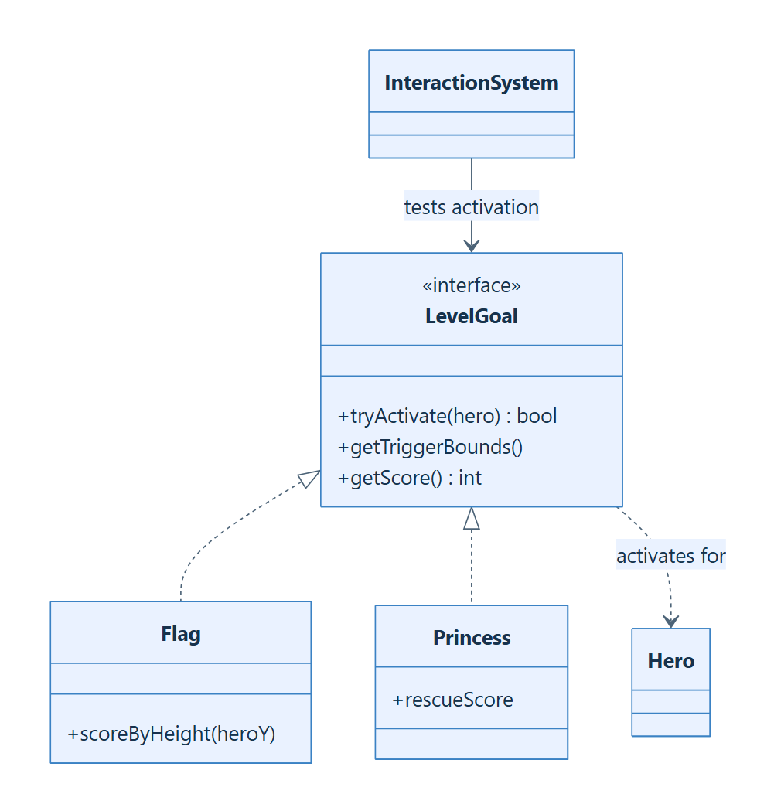
<figcaption>Polymorphic level goals.</figcaption>
</figure>

`LevelGoal` is a non-rendering gameplay interface with a trigger,
activation state, score result, activation effect, and completion music.
`Flag` calculates a score between configured minimum and maximum values
from the hero's vertical contact position. `Princess` awards a fixed
rescue score and selects its own completion cues. The map remains
responsible for visual goal tiles; the goal object represents only
semantic activation.

`InteractionSystem` attempts activation after all harmful interactions
for the frame and returns the award. `PlayingState` observes the
activated goal, locks the hero in Cheer state, plays completion music,
and opens the Victory overlay. This divides domain policy (whether/what
a goal awards) from screen policy (how completion is presented and where
navigation goes).

## Save, Load, HUD, and Audio Services

### Persistence class diagram and workflow

<figure id="fig:save-load-diagram" data-latex-placement="htbp">
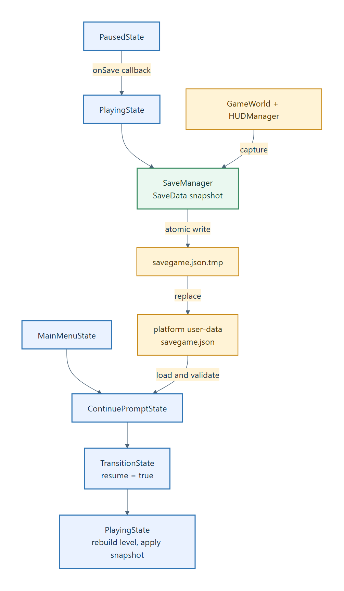
<figcaption>Pause-save and menu-continue workflow.</figcaption>
</figure>

`SaveData` records map and tileset paths; hero position, HP, coins,
type, form, invincibility and Starman state; alive enemy position,
velocity, direction, health, grounded flag and AI state; additional Thor
King counters; hit and destroyed blocks; active item type and position;
active projectile type, position, velocity, and faction; and HUD score,
coins, lives, and time.

`SaveManager::defaultSavePath` chooses a per-user application-data
directory on Windows, macOS, and other systems. `existingSavePath` also
searches legacy working-directory locations. Saving serializes JSON to a
temporary file, flushes and closes it, and then atomically replaces the
target where the operating system permits. This is safer than truncating
the only valid save before a complete new snapshot is available.

Loading validates the JSON root, required level paths, hero object,
supported hero name, array types, and projectile faction before
replacing in-memory `SaveData`. Continue first rebuilds the referenced
level so static map content and callbacks exist, then `applySaveToWorld`
replaces the hero, enemies, items, and projectiles through their
factories, updates block/map state, restores HUD values, and
synchronizes camera region and music.

The persistence model is a snapshot, but not every transient variable is
captured. Hero velocity, grounded/movement state, item velocity/spawn
phase, projectile lifetime/impact phase, lifter phase, activated goals,
active region, and exact boss AI timer are recomputed or reset. This is
a deliberate current boundary: it produces a playable continuation but
not bit-for-bit deterministic resumption of the prior frame. A future
versioned save schema should add an explicit format version and stable
identifiers if exact restoration is needed.

### HUD

`HUDManager` is both the model for score, coins, lives, world label, and
remaining time and an `sf::Drawable` view of those values. Mutation
methods immediately regenerate the displayed strings. `PlayingState`
applies score deltas from `LevelRuntime`, observes hero coin changes,
sets the compact world label from `LevelCatalog`, updates time, and
performs attempt/life restoration. A shared pointer lets the same HUD
survive Transition, Playing, and Victory states.

### Audio

`SoundManager` scans an SFX directory into named `sf::SoundBuffer`
objects, reuses a bounded pool of `sf::Sound` channels, and streams one
`sf::Music` track for BGM. It supports independent SFX/BGM volumes and a
master-volume operation. `Game` owns it, settings modify it, screens
select menu/game/result music, and gameplay systems request effects
directly or through callbacks. Keeping the service above the level
ensures music and volume survive state replacement.

## Animation, Textures, and Other Utilities

<figure id="fig:utility-diagram" data-latex-placement="htbp">
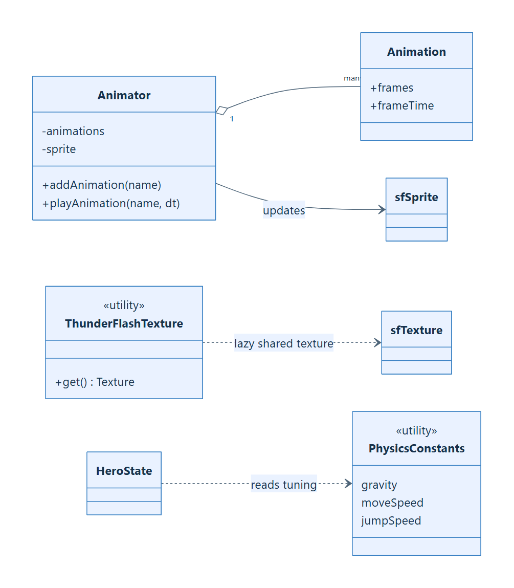
<figcaption>Reusable animation and texture utilities.</figcaption>
</figure>

`Animation` stores frame rectangles and duration, while `Animator`
stores named animations and mutates a referenced `sf::Sprite`'s texture
rectangle over time. Characters, blocks, items, and selected projectiles
reuse this component. Concrete hero constructors register the combined
form/state keys required by `Hero::update`.

`ThunderFlashTexture::get` lazily loads and transparency-processes the
Thunder Flash sheet and returns a shared non-owning texture pointer.
Lazy creation ensures an SFML graphics context exists before the OpenGL
resource is initialized and avoids processing the same image for every
Flash-related object. `PhysicsConstants.h` centralizes hero movement
tuning rather than scattering values across movement states.

## Ownership, Coupling, and Extension Rationale

The principal ownership rules are:

- `Game` uniquely owns screen states and the audio service;

- `PlayingState` owns its `LevelRuntime` by value and shares one HUD
  across related states;

- `LevelRuntime` owns the world and systems by value;

- `GameWorld` uniquely owns the hero and all entity instances;

- `Hero` uniquely owns its form and movement state;

- `Enemy` uniquely owns its AI state;

- `Block` uniquely owns a hidden item prototype; and

- pointers to `SoundManager`, references to `BlockThemePalette`, and
  callback captures are non-owning.

This arrangement avoids cycles among smart pointers. Spawn callbacks
transfer `unique_ptr` ownership outward to the world, while
notifications carry events without exposing the world's internals.
Abstract bases are used where the world needs uniform
lifetime/update/render behavior. Capability methods such as `isSolid`,
`canBeHitFromBelow`, `usesWorldPhysics`, and `onSolidCollision` are
preferred over concrete casts; casts remain for explicitly boss-specific
behavior.

To add a hero, implement the concrete texture/animation table and
special projectile Factory Method, add a `HeroType` and factory mapping,
then add selection UI and save parsing. To add an enemy, implement its
state/physics/ animation requirements, add an enemy factory mapping,
recognize its Tiled spawner class, and add save support if it has unique
transient data. To add a level, add the TMJ/TSX-compatible data, a
`LevelCatalog` entry, valid start/end triggers, and only those playable
regions/pipes/boss markers intended by the design. These extension paths
explain why construction, simulation, and presentation are separated.

## Current Constraints and Improvement Opportunities

The current design is coherent but has several explicit trade-offs:

- entity, state, form, animation, Tiled-class, and audio identifiers are
  strings in multiple boundaries; centralized constants or typed IDs
  would reduce spelling-dependent behavior;

- Observer behavior is callback/direct-notification based rather than a
  reusable typed event system, and coin synchronization is currently
  polled;

- some constructors load textures independently, so a general asset
  cache would reduce duplicate I/O and texture memory;

- state updates and most interactions use linear scans; spinning-shell
  and projectile targeting can become quadratic with many enemies, so
  spatial partitioning would be the next scaling step;

- the level builder still materializes a rectangle for each solid tile
  even though active collision uses nearby tile-grid queries; removing
  or repurposing the redundant collection would reduce large-level
  memory and load work;

- boss VFX and debug phase/form hotkeys are currently in `PlayingState`;
  a dedicated boss encounter/presentation component would keep the scene
  controller smaller;

- save files have validation but no schema version or migration layer;
  and

- there is no project-owned automated test target in the current CMake
  configuration, so regression verification depends on builds and manual
  play.

These are evolution points, not reasons to collapse the present
subsystem boundaries. Improvements should preserve world ownership,
deferred cleanup, the physics/interaction split, and state-transition
safety.

## Build and Deployment Structure

`CMakeLists.txt` declares a C++17 executable named `Custom2DPlatformer`,
obtains SFML 2.6.1 through CMake FetchContent, recursively includes
project source/header directories, and links SFML graphics, window,
system, and audio libraries statically. A post-build command copies the
complete `assets` directory beside the executable. On Windows it also
copies the architecture-correct `openal32.dll`, because SFML's OpenAL
audio backend remains a runtime dependency even when SFML itself is
linked statically. This explains why asset paths are relative to the
executable working directory and why both assets and OpenAL must
accompany a distributed binary.

## Complete Source-File Catalogue {#subsec:source-file-catalogue}

This catalogue accounts for every current project-owned C++ header and
source file. A notation such as denotes the declaration and its
implementation at the corresponding and paths. Interface-only headers
are identified explicitly.

plus 1mu

### Bootstrap and core application

- : process entry point and Windows I/O compatibility shim.

- / : singleton application object, loop, audio, state stack, selection,
  and deferred transitions.

- : abstract screen-state interface.

- : shared collision-side enum.

- / : AABB collision and resolution helpers.

- : compile-time level metadata and next-level lookup.

### Screen states

- / .

- / .

- / .

- / .

- / .

- / .

- / .

- / .

- / .

- / .

- / .

### Gameplay runtime

- / : world ownership and cleanup.

- / : live-level facade and frame pipeline.

- / : map-to-world construction.

- / : movement and solid collision.

- / : semantic contacts and scoring.

- / : region-sensitive block textures.

### Character and hero files

- / : abstract character root.

- / : common hero behavior.

- / : hero construction.

- / ; / ; and / : concrete heroes.

### Hero form and movement-state files

- : abstract form strategy.

- / .

- / .

- / .

- : abstract movement-state interface.

- / .

- / .

- / .

- / .

- / .

- / .

- / .

- / .

- / .

### Enemy and boss files

- / : common enemy entity.

- / : static and polymorphic enemy factories.

- / : common AI states.

- / : saved-state reconstruction.

- / , / , and / .

- / , / , and / .

- / , / , and / .

- / , / , / , and / .

- / : shared projectile abstraction retained in the enemy directory for
  historical compatibility.

- / : Witch projectile.

### Block files

- / and / .

- / and the declaration-only .

- / .

- / .

- / .

### Item files

- / and / .

- / .

- / .

- / .

- / .

- / .

### Hero projectile and goal files

- / .

- / .

- / .

- / .

- : goal interface.

- / .

- / .

### Manager and utility files

- / and / .

- / .

- / .

- / .

- / .

- / .

- : shared movement constants.

- / : shared processed texture.

Finally, and are vendored third-party headers rather than
project-authored domain classes. They are nevertheless part of the
build: uses them to parse TMJ files and uses them to serialize and
validate save snapshots. is the project's build description and
completes the code/build inventory.

# Applied Design Patterns {#sec:applied-design-patterns}

The project uses design patterns at several different scales. Some
patterns control the lifetime and navigation of the application, some
provide extension points for gameplay objects, and others isolate the
creation of families of entities.
Table [1](#tab:pattern-summary){reference-type="ref"
reference="tab:pattern-summary"} gives the principal mapping from the
pattern vocabulary to the concrete implementation.

::: {#tab:pattern-summary}
  **Pattern**      **Principal participants**                                                                               **Purpose in the game**
  ---------------- -------------------------------------------------------------------------------------------------------- ----------------------------------------------------------------------------------------------------------------------------
  Singleton        `Game`                                                                                                   Provides one process-wide window, state stack, audio service, and selected character/level configuration.
  Factory          `HeroFactory`, `EnemyFactory`, `BlockFactory`, `ItemFactory`, `ProjectileFactory`, `EnemyStateFactory`   Converts compact types or saved/map strings into polymorphic runtime objects.
  State            Application `State`; `HeroState`; `EnemyState`                                                           Represents screens, hero movement modes, and enemy/boss AI modes without large central conditionals.
  Strategy         `HeroForm` with `SmallForm`, `GiantForm`, and `FireForm`                                                 Changes size, texture, input capabilities, special attack policy, and damage response at run time.
  Observer         Sound/projectile callbacks and HUD notifications                                                         Propagates gameplay events to the world, sound service, and display without giving entities ownership of those receivers.
  Prototype        `Item::clone`, especially `PowerUpPrototype`                                                             Lets a block retain one item description and create context-sensitive rewards when hit.
  Facade           `LevelRuntime`                                                                                           Presents one update/render interface over world ownership, construction, physics, interactions, regions, pipes, and goals.
  Factory Method   `Hero::createSpecialProjectile`                                                                          Allows the invariant special-ability workflow to create a hero-specific projectile.
  Object Pool      `SoundManager::m_sfxPool`                                                                                Reuses a bounded number of SFML sound channels for overlapping effects.

  : Design patterns identified in the current implementation.
:::

## Singleton Pattern {#subsec:singleton-pattern}

### Intent and participants

The Singleton pattern ensures that a class has one instance and supplies
a global access point to it. The project applies the pattern to `Game`.
Its constructor is private, its copy constructor and assignment operator
are deleted, and `Game::getInstance()` returns a function-local static
instance. This is the "Meyers Singleton" form: construction occurs on
first use, and C++ guarantees thread-safe initialization of the local
static object.

<figure data-latex-placement="htbp">
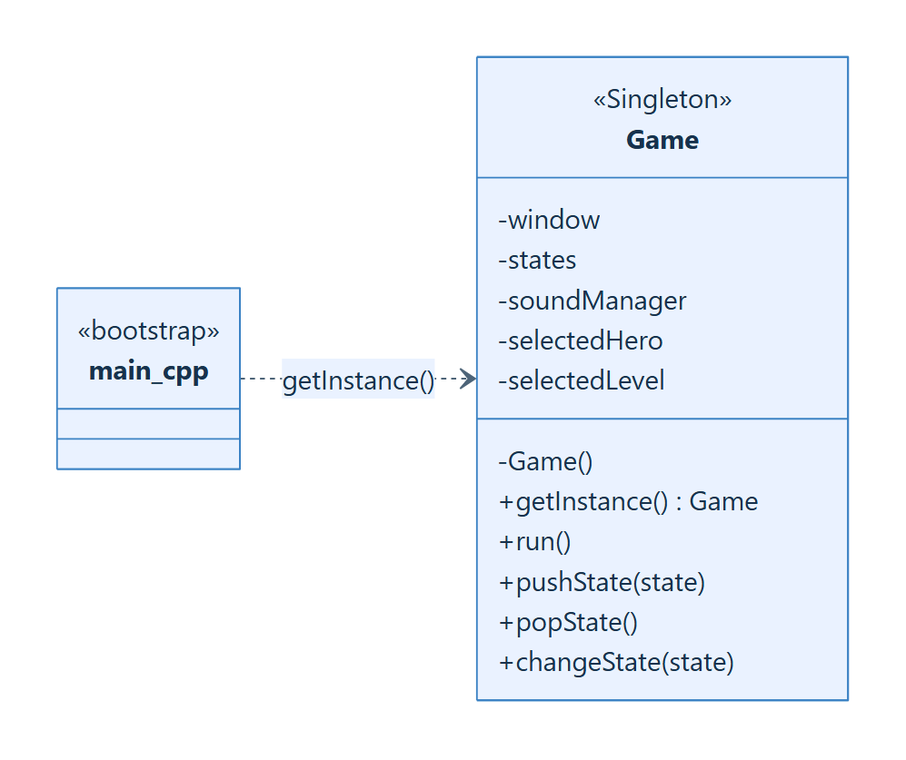
<figcaption>The single <code>Game</code> object owns process-wide
application state.</figcaption>
</figure>

The bootstrap in `src/main.cpp` obtains the instance twice: first to
queue a `MainMenuState`, and then to start `run()`. Screen objects use
the same access point to request state transitions, obtain the
`SoundManager`, and read or update the selected hero, selected level,
and volume settings.

### Why it fits

SFML should have one authoritative render window and one main loop.
Likewise, the state stack and deferred transition request must agree on
which screen is active. Centralizing these resources prevents accidental
creation of a second window, independent audio service, or competing
navigation stack. The function-local static also avoids the
static-initialization-order problem that would arise from a
namespace-scope `Game` object.

The cost is global coupling: states call `Game::getInstance()` directly,
which makes isolated unit tests harder and makes dependencies less
visible in constructors. This is acceptable for the current small
application shell, but future testing could introduce narrow interfaces
such as a state navigator or audio service and inject those interfaces
while retaining a single production `Game` instance.

## Factory Patterns {#subsec:factory-patterns}

### Simple factories for entity families

The project uses several centralized creation functions. Each returns a
`std::unique_ptr` to an abstract or base type, hiding concrete
constructors from the caller:

- `HeroFactory::createHero` maps `HeroType` to `Mario`, `Luigi`, or
  `Flash`, while forwarding the projectile-spawn callback.

- `EnemyFactory::createEnemy` maps `EnemyType` to `Goomba`, `Koopa`,
  `Witch`, or `ThorKing`. Its string overload supports map and
  persistence data.

- `BlockFactory::createBlock` builds `BrickBlock`, `QuestionBlock`, or
  `InvisibleBlock`, attaches a hidden item prototype, and supplies the
  shared `BlockThemePalette` where needed.

- `ItemFactory::createItem` supports both the enum-based level builder
  and the string-based save loader.

- `ProjectileFactory::createProjectile` reconstructs hero and enemy
  projectiles from saved type names, velocities, and factions.

- `EnemyStateFactory::createStateFromString` reconstructs ordinary enemy
  AI states such as `Patrol`, `Squished`, `Shell`, `SpinningShell`,
  `FlippingDeath`, and `Throw`.

<figure data-latex-placement="htbp">
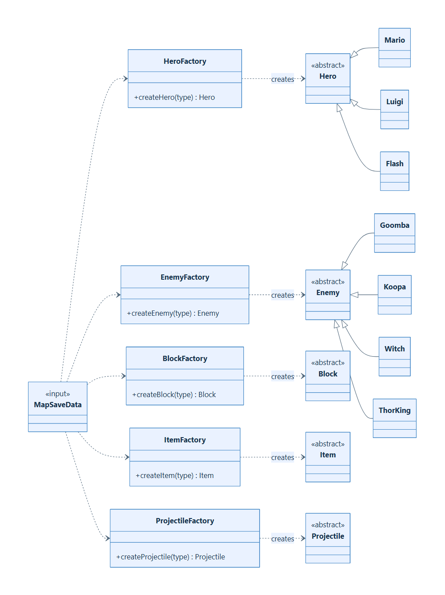
<figcaption>Factories translate data-oriented identifiers into owned
polymorphic objects.</figcaption>
</figure>

This design is especially important at the data boundary. `LevelBuilder`
does not need sprite initialization details for every entity, and
`SaveManager` does not depend on every concrete constructor. Adding a
new product normally requires a new concrete class, one factory mapping,
and the relevant builder or serialization mapping rather than changes
throughout the game loop.

### Polymorphic factory interface

`BaseEnemyFactory` with `ConcreteGoombaFactory` and
`ConcreteKoopaFactory` is the project's explicit polymorphic factory
hierarchy. A client can hold a `BaseEnemyFactory` reference and call
`create()` without knowing the product type. The current runtime mainly
uses the static `EnemyFactory`; therefore the concrete factory hierarchy
is a valid extension point but is not the primary construction route.

### Factory Method for hero attacks

The hero special attack is a smaller Factory Method example. The public
`Hero::specialAbility()` method owns the stable algorithm: verify that a
spawn callback exists, ask for a projectile, and transfer ownership to
the world. The protected pure virtual `createSpecialProjectile()` is
overridden by each hero:

- `Mario` creates a bouncing `MarioFireball`;

- `Luigi` creates an arcing `LuigiWaterBomb`;

- `Flash` creates a fast `FlashThunder` strike.

Thus the base class fixes when and how an attack is published, while
subclasses decide what concrete product is created.

## State Pattern {#subsec:state-pattern}

The project applies State three times. These applications have the same
intent---delegating behavior to a replaceable object---but operate at
different levels and should not be confused with one another.

### Application and screen states

`State` defines the common `processEvents`, `update`, and `render`
operations. `Game` owns a stack of `std::unique_ptr<State>` and forwards
each event/update to the top state. Rendering may include lower states
when the top state returns `true` from `rendersBelow()`, which is used
by modal overlays such as pause, continue prompt, and victory.

The concrete states are `MainMenuState`, `ContinuePromptState`,
`CharacterSelectState`, `LevelSelectState`, `GuideState`,
`SettingsState`, `TransitionState`, `PlayingState`, `PausedState`,
`VictoryState`, and `GameOverState`. Transitions are requested with
`pushState`, `popState`, `changeState`, or `clearStatesAndChange`.
`Game` defers the request until it is outside the outgoing state's
callback, preventing an object from being destroyed while one of its
methods is still executing.

<figure data-latex-placement="htbp">
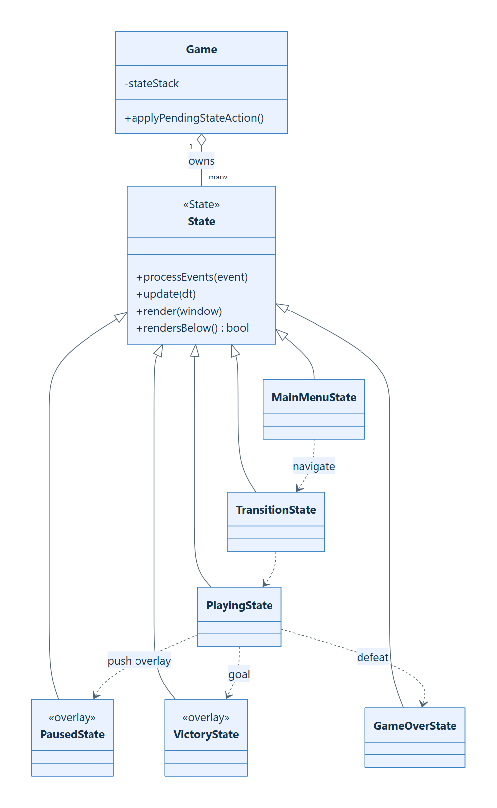
<figcaption>Application State pattern and the state stack.</figcaption>
</figure>

### Hero movement states

`Hero` owns exactly one `HeroState`. The interface supplies `enter`,
`exit`, `update`, and `getState`. The concrete states are `IdleState`,
`RunState`, `JumpState`, `SlideState`, `SitState`, `GrowState`,
`ShrinkState`, `DeadState`, and `CheerState`. State objects interpret
input, set velocity, alter the hitbox when necessary, select animations
through their names, and initiate transitions by calling
`Hero::setState`.

For example, an idle hero enters `RunState` when horizontal input is
held, `JumpState` when jumping, and `SitState` when a powered form
crouches. Reversing direction while moving can enter `SlideState`.
Transformation states temporarily lock motion before installing a new
form, while `DeadState` and `CheerState` suppress normal control for
defeat and victory respectively. `JumpState`'s `AirEntry` value
distinguishes a deliberate jump from walking off a ledge.

### Enemy and boss AI states

`Enemy` similarly owns an `EnemyState`. Its `changeState` method calls
`onExit` on the old object and `onEnter` on the new object. General
states implement patrolling, squishing, a stationary shell, a spinning
shell, and flipping death. `Witch` adds `ThrowState`. `ThorKing` extends
the same interface with `TKPatrolState`, `TKCrouchState`,
`TKRollingState`, `TKStunnedState`, `TKFireAttackState`, and
`TKRoarState`. These objects express multi-phase boss behavior while the
`ThorKing` entity retains shared HP, phase counters, movement data,
projectile callback, and sound callback.

The State design localizes transition rules and makes save/load
possible: ordinary enemy state names are mapped back to state objects by
`EnemyStateFactory`. The present persistence code restores Thor King's
counters and resumes it in a patrol state, so not every transient boss
timer is serialized.

## Strategy Pattern {#subsec:strategy-pattern}

`HeroForm` is a Strategy family installed inside `Hero` alongside the
independent movement-state object. Its operations---`enter`, `update`,
`getForm`, and `takedamage`---represent the parts of hero behavior that
vary with power level rather than movement mode.

<figure data-latex-placement="htbp">
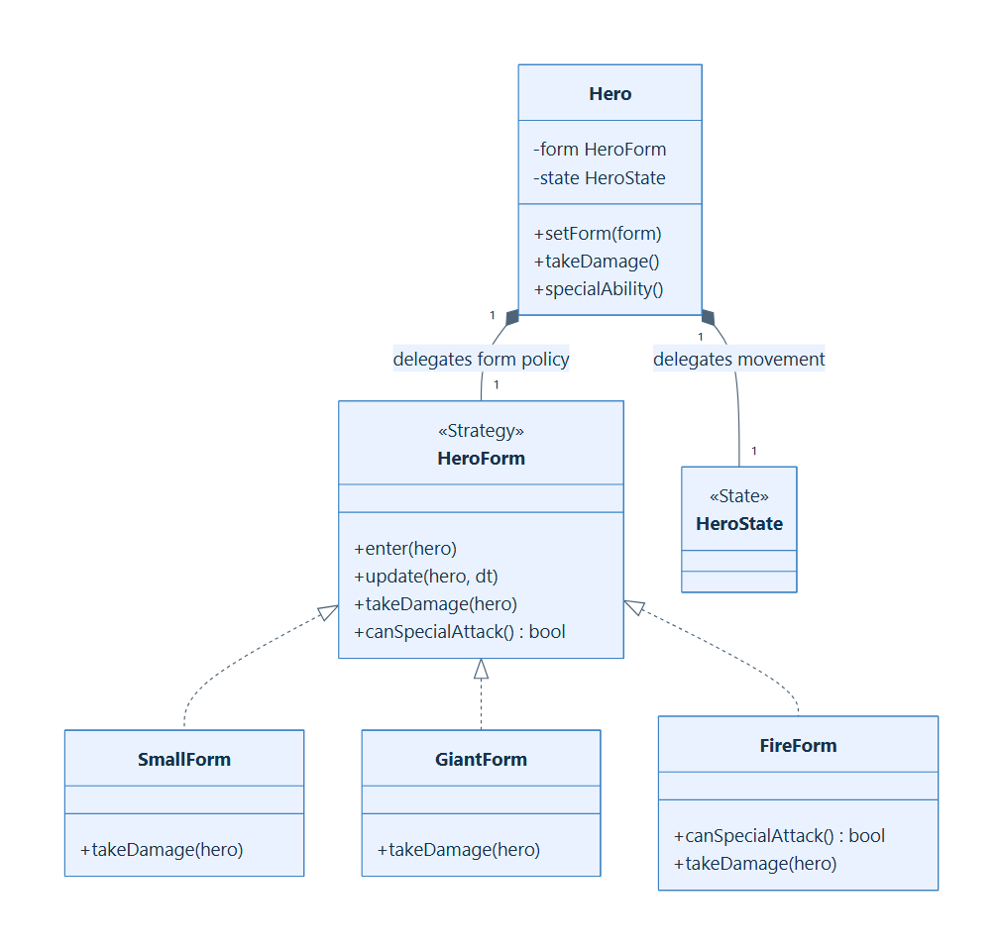
<figcaption>Hero form is a run-time strategy independent of movement
state.</figcaption>
</figure>

`SmallForm` selects the base texture and a $32\times32$ hitbox and dies
on damage. `GiantForm` uses a $32\times64$ standing hitbox, permits
crouching, and changes damage into a shrink transition. `FireForm` loads
each hero's special texture, applies a per-hero cooldown, invokes the
Factory Method for the special projectile, and downgrades through Giant
form when hit. For Mario this special strategy is Fire Mario; for Luigi
it is the Kitsune form and water bomb; for Flash it is Thunder Flash and
a thunder strike.

This two-axis design prevents a combinatorial class explosion. The
project does not require classes such as `RunningFireMario`,
`JumpingGiantLuigi`, or `SittingThunderFlash`; an animation key is
instead composed from the current form and state names. Adding a
movement state is mostly independent of adding a power form.

The enemy classes also use small statically composed policy helpers:
`GoombaPhysics`/`GoombaAnimator`, `KoopaPhysics`/`KoopaAnimator`,
`WitchPhysics`/`WitchAnimator`, and
`ThorKingPhysics`/`ThorKingAnimator`. They have no shared strategy
interface and are not swapped at run time, so they are best described as
strategy-like separation of physics and presentation rather than a
complete GoF Strategy implementation.

## Observer Pattern {#subsec:observer-pattern}

The implementation uses a lightweight callback form of Observer. It
avoids giving gameplay entities pointers to the complete scene and
avoids a universal event bus. The significant notification channels are:

- `ProjectileSpawnCallback`: `Hero` publishes a newly created
  projectile; `GameWorld::addProjectile` is the receiver. The same
  ownership-transfer idea is used by `Witch` and `ThorKing` for enemy
  projectiles.

- `Hero::playSFXCallback`: forms and blocks may request effects through
  the hero; `GameWorld::setHero` connects the callback to the non-owning
  `SoundManager` service.

- `ThorKing::m_soundCallback`: the boss publishes
  `BossSoundEvent::Attack` and `BossSoundEvent::Defeated`; the level
  builder connects these notifications to the appropriate effects.

- HUD notifications: `PlayingState` observes score deltas, hero coin
  count, lives, time, and the selected world, then invokes
  `HUDManager`'s update methods. This is explicit observation rather
  than subscription through an abstract observer interface.

<figure data-latex-placement="htbp">
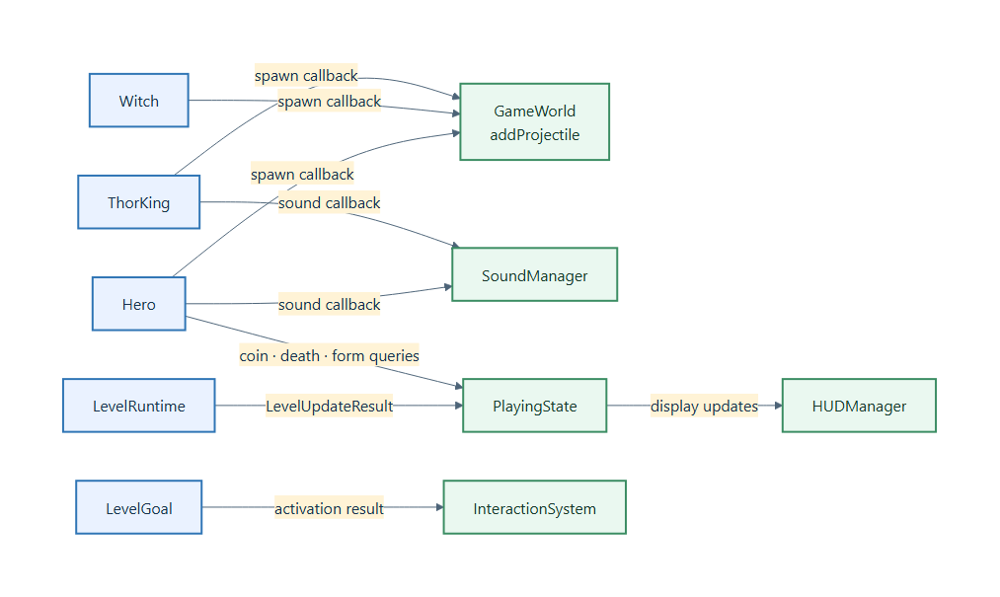
<figcaption>Callback and explicit-notification form of
Observer.</figcaption>
</figure>

The approach keeps ownership clear: a callback transfers a `unique_ptr`
when spawning, whereas the audio pointer is non-owning and outlives the
level because it belongs to `Game`. Its limitation is that subscriptions
are hand-wired and the HUD is partly polled, so adding many new event
consumers would justify a typed event dispatcher or formal
`Subject`/`Observer` interfaces.

## Prototype Pattern {#subsec:prototype-pattern}

`Item` declares `clone(Hero*)`. A `Block` owns one `unique_ptr<Item>` as
its hidden prototype plus a remaining count. When the block is hit,
`releaseHiddenItem` asks the prototype to clone itself, positions and
spawns the result, decrements the count, and releases the prototype
after the last item.

The most useful prototype is `PowerUpPrototype`. It is not itself a
visible collectible. At clone time it examines the hero's current form
and returns a `Mushroom` for a small hero or a `Flower` for an already
powered hero. Therefore the Tiled map can say "power-up" once without
hard-coding which reward is correct for the player's current context.
The concrete `Coin`, `Star`, `Mushroom`, and `Flower` classes also
implement `clone`; coin cloning additionally awards the coin immediately
for the block-bounce visual.

<figure data-latex-placement="htbp">
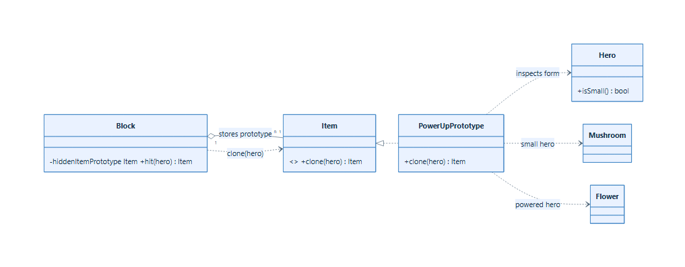
<figcaption>Prototype supports repeated and context-sensitive hidden
items.</figcaption>
</figure>

## Facade Pattern {#subsec:facade-pattern}

`LevelRuntime` is the facade for one live level. `PlayingState` does not
directly coordinate every entity collection, collision pass, goal, or
map object. It constructs the facade, calls `update`, calls
`renderWorld`, queries the hero and active region, and reacts to the
returned `LevelUpdateResult`.

Behind that interface, `LevelRuntime` owns `GameWorld`,
`WorldPhysicsSystem`, and `InteractionSystem`; delegates initial
construction to `LevelBuilder`; caches playable regions and pipe routes;
maintains the active theme and fall boundary; enforces the boss-arena
boundary; performs cleanup; and exposes goal completion. The facade
makes the per-frame ordering explicit while keeping scene presentation
in `PlayingState`.

## Object Pool Pattern {#subsec:object-pool-pattern}

`SoundManager` loads sound buffers once and keeps a bounded vector of
`sf::Sound` channels. When an effect is requested, it first searches for
a stopped channel and reuses it; only when no stopped channel exists
does it allocate another channel, up to `m_maxSfxChannels`. This is a
small Object Pool that permits overlapping sound effects without
allocating a new SFML sound object for every event or allowing the
number of active channels to grow without limit. Background music is
handled separately as a streamed `sf::Music` object.

## Pattern Collaboration and Design Consequences {#subsec:pattern-collaboration}

The patterns are most valuable in combination. The Singleton owns the
screen State context and long-lived audio service. A selected screen
constructs the Level Facade. The Facade delegates data-driven
construction to Factories and stores products in `GameWorld`. During
play, Hero and Enemy State objects select short-term behavior, while the
Hero Form Strategy selects the orthogonal power policy. Prototype
creates context-sensitive block rewards, and Observer-style callbacks
publish spawned objects and sound events without transferring control of
the complete world to an entity.

The implementation consistently uses RAII ownership to reinforce these
patterns. Screens, entities, forms, states, and projectiles are normally
held by `std::unique_ptr`; the HUD is a `std::shared_ptr` because it
must survive transitions and retries; service links and callback
captures are non-owning. This makes destruction deterministic and
documents whether a relationship means ownership, sharing, or temporary
collaboration.

# Technical Problems and Solutions {#sec:technical_problems_and_solutions}

During the development, architectural refactoring, and feature expansion
of the 2D Platformer engine, several critical technical challenges
emerged across the **Animation Subsystem**, **Finite State Machine
(FSM)**, **Object-Oriented Hierarchy**, **World Physics Engine**, and
**State Persistence Architecture**. This section details the most
prominent engineering bottlenecks encountered and the mathematical,
algorithmic, and architectural solutions designed to resolve them.

## Sprite Origin Misalignment and Center-of-Mass Jittering {#subsec:sprite_misalignment}

### Problem Formulation

When integrating high-resolution, non-uniform sprite sheets for advanced
character forms (e.g., *Epic Archmage Flash*, *Fire Mario*, and *Kitsune
Luigi*), significant visual anomalies were observed during gameplay:

1.  **Horizontal Jerking / Positional Sliding:** Transitioning between
    discrete animation states (e.g.,
    $\text{Idle} \rightarrow \text{Run} \rightarrow \text{Special Skill}$)
    caused characters to abruptly shift horizontally across the terrain.

2.  **Limb and Prop Truncation:** Attempting to eliminate jitter by
    tightly cropping sprite bounding boxes inadvertently severed
    character extremities (such as Mario's outstretched casting arm or
    Luigi's bushy fox tail).

The root cause originated from the generic origin assignment implemented
in the rendering utility: $$\begin{equation}
    \mathbf{O}_{\text{generic}} = \left( \frac{W_{\text{rect}}}{2}, \; H_{\text{rect}} \right)
\end{equation}$$ Because character silhouettes within tight rectangular
bounds ($W_{\text{rect}}$) are geometrically asymmetric, the bounding
box midpoint $\frac{W_{\text{rect}}}{2}$ deviated substantially from the
character's physical vertical anchor axis (the physical center of mass,
$CM_x$), generating an instantaneous visual displacement upon every
state transition.

### Engineering Solution

Rather than compromising asset integrity through tight cropping or
polluting the core engine with hardcoded per-frame offsets, an automated
**Mathematical Center-of-Mass ($CM$) Padding Algorithm** was formulated
and executed via image-processing scripts.

#### 1. Center of Mass Computation:

For an arbitrary frame sub-region of width $W$ and height $H$, the
horizontal center of mass is computed across all opaque body pixels:
$$\begin{equation}
    CM_x = \frac{\sum_{y=Y_{\min}}^{Y_{\max}} \sum_{x=X_{\min}}^{X_{\max}} x \cdot \mathbb{I}(\alpha(x, y) > \tau)}{\sum_{y=Y_{\min}}^{Y_{\max}} \sum_{x=X_{\min}}^{X_{\max}} \mathbb{I}(\alpha(x, y) > \tau)}
\end{equation}$$ where $\alpha(x, y) \in [0, 255]$ represents the pixel
alpha channel, $\tau = 25$ is the opacity threshold, and
$\mathbb{I}(\cdot)$ is the indicator function.

#### 2. Symmetric Geometric Padding:

Given the calculated anchor $CM_x$ and the true visual bounds
$[X_{\min}, X_{\max}]$, symmetric transparent space is injected to force
the geometric midpoint to coincide with $CM_x$: $$\begin{equation}
    X_{\text{rect}}, W_{\text{rect}} = 
    \begin{cases} 
        \left( X_{\min}, \; 2 \cdot (CM_x - X_{\min}) \right) & \text{if } CM_x \ge \frac{X_{\min} + X_{\max}}{2} \\
        \left( 2 \cdot CM_x - X_{\max}, \; 2 \cdot (X_{\max} - CM_x) \right) & \text{if } CM_x < \frac{X_{\min} + X_{\max}}{2}
    \end{cases}
\end{equation}$$ This formulation guarantees that the origin
$\frac{W_{\text{rect}}}{2}$ remains strictly aligned with the
character's physical foot position ($100\%$ jitter elimination) while
preserving all extended visual effects and staff/tail animations.

## Finite State Machine (FSM) Oscillation and Frame Freezing {#subsec:fsm_oscillation}

### Problem Formulation

During locomotion testing, characters exhibited a severe defect where
holding the movement keys caused the sprite to freeze on a single static
frame while translating across the floor (appearing to "skate" without
playing the stride animation).

Code inspection of the locomotion state machine (`RunState.cpp`)
revealed an unguarded velocity threshold check: $$\begin{equation}
    \text{if } (|v_x| < v_{\text{stop}}) \implies \text{Transition to } \mathtt{IdleState}
\end{equation}$$ When accelerating from rest, initial horizontal
velocity $v_x$ initiates at $0.0\,\text{px/s}$, which is strictly below
$v_{\text{stop}} = 8.0\,\text{px/s}$. Consequently, on every frame:

1.  `IdleState` detected keypress $\rightarrow$ transitioned to
    `RunState`.

2.  On the immediate subsequent tick, `RunState` detected
    $|v_x| < 8.0\,\text{px/s}$ $\rightarrow$ prematurely reverted to
    `IdleState`.

3.  This high-frequency state oscillation continuously triggered
    `Hero::setState()`, resetting the animation accumulator
    ($\mathtt{currentFrameIndex} = 0$), permanently locking the
    character on Frame 0.

### Engineering Solution

The transition guard was redesigned to decouple player intentionality
from instantaneous kinematic magnitude by constructing a composite
boolean invariant: $$\begin{equation}
    \text{Transition}(\mathtt{RunState} \rightarrow \mathtt{IdleState}) \iff \left( \neg \mathtt{pressLeft} \land \neg \mathtt{pressRight} \right) \land \left( |v_x| < v_{\text{stop}} \right)
\end{equation}$$ This condition ensures that as long as directional
input remains active, the FSM remains locked in `RunState`, allowing
uninterrupted animation frame delta accumulation and fluid multi-frame
locomotion.

## Elimination of Hardcoded Ground Constraints via Dynamic Gravity Kinematics {#subsec:dynamic_gravity}

### Problem Formulation

In early engine iterations, physical entities (including power-up items
such as *Mushrooms* and *Flowers*, dynamic throwables such as *Potions*,
and spawned *Enemies*) relied on static, hardcoded vertical offsets
($Y$-coordinates) mapped to flat ground planes. This introduced severe
structural fragility:

- When deploying multi-tier levels (such as underground rooms, floating
  platforms, and elevated pipe structures in World 1-1 and World 1-3),
  entities spawned with fixed parameters either hovered in mid-air or
  intersected solid terrain blocks.

- Kinematic item trajectories (e.g., mushrooms popping out of Question
  Blocks) lacked realistic arc landing mechanics across irregular
  terrain contours.

### Engineering Solution

To enforce map-agnostic behavior, static spatial assumptions were
eliminated in favor of a **Unified Dynamic Gravity and AABB Collision
Resolution Subsystem** within `WorldPhysicsSystem`:

#### 1. Kinematic Velocity Integration:

Every dynamic entity updates vertical velocity under constant
gravitational acceleration: $$\begin{align}
    v_y(t + \Delta t) &= \min\left(v_y(t) + g \cdot \Delta t, \; v_{\text{terminal}}\right) \\
    y(t + \Delta t) &= y(t) + v_y(t + \Delta t) \cdot \Delta t
\end{align}$$ where $g = 1568\,\text{px/s}^2$ and
$v_{\text{terminal}} = 960\,\text{px/s}$ prevents collision tunneling
through thin tile boundaries.

#### 2. Continuous Ground Snapping:

During vertical collision passes against the terrain grid, ground
contact is resolved dynamically: $$\begin{equation}
    \text{if } \text{CollisionSide} == \mathtt{Top} \implies 
    \begin{cases}
        y_{\text{resolved}} = y_{\text{tile\_top}} - H_{\text{hitbox}} \\
        v_y = 0 \\
        \mathtt{isGrounded} = \text{true}
    \end{cases}
\end{equation}$$ This mathematical resolution guarantees that all
characters, dropped items, and projectiles dynamically conform to
arbitrary terrain topography with zero manual configuration.

## Polymorphic Multi-Tier Hero Evolution and Texture Routing {#subsec:polymorphic_evolution}

### Problem Formulation

Procedural texture loading in `HeroForm` subclasses previously invoked
`hero->loadTexture(baseTexturePath)` directly upon entry. When
integrating heroes with independent asset sets (e.g., *Flash* utilizing
`thunderflash2.png` or *Luigi* utilizing `KitsuneLuigi.png`), procedural
transitions caused texture coordinate mismatches and skipped growth
forms, violating the **Open/Closed Principle (OCP)**.

### Engineering Solution

The evolution subsystem was refactored using the **State/Strategy
Pattern**:

1.  **Polymorphic Texture Dispatch:** Overrode `Hero::loadTexture()` in
    specialized classes to dynamically resolve resource bindings based
    on active form state.

2.  **Decoupled Multi-Tier Scaling:** Implemented independent rendering
    scale metrics: $$\begin{equation}
            S_{\text{render}} = 
            \begin{cases} 
                S_{\text{small}} & \text{if } \mathtt{Form} == \text{Small} \quad (32\times 32\,\text{px hitbox}) \\
                S_{\text{giant}} & \text{if } \mathtt{Form} == \text{Giant} \quad (32\times 64\,\text{px hitbox}) \\
                S_{\text{special}} & \text{if } \mathtt{Form} == \text{Fire/Special} \quad (32\times 64\,\text{px hitbox})
            \end{cases}
    \end{equation}$$

3.  **Uniform 3-Tier Hierarchy:** Standardized progression across all
    playable heroes:
    $\text{Small Form} \xrightarrow{\text{Mushroom}} \text{Giant Form} \xrightarrow{\text{Flower}} \text{Tier-3 Special Form}$.

## World State Serialization and Dynamic Deserialization (Save/Load) {#subsec:save_load_architecture}

### Problem Formulation

Implementing persistent world serialization (`F5` Quick Save, `F9` Quick
Load) required capturing a heterogeneous runtime state containing:

- Dynamic entities (enemies with remaining state timers, active
  projectiles, roaming items).

- Spatial world modifications (permanently hit question blocks,
  shattered brick blocks removed from the collision matrix).

- Player inventory, form type, invincibility I-frames, and HUD progress
  metrics.

### Engineering Solution

A **Base Level Reload $\rightarrow$ State Overlay Pipeline** was
engineered within `SaveManager` using JSON serialization:

1.  **Phase 1: Deterministic Base Reload:** `LevelRuntime::reload()`
    re-instantiates the raw TMX/TMJ tile matrix and baseline colliders.

2.  **Phase 2: Dynamic State Overlay:**

    - **Tile Matrix Mutation:** Querying coordinates $(T_x, T_y)$
      against serialized `destroyedBlocks` updates the interactive
      vertex mesh via `setTileID("Interactive", tx, ty, 0)`.

    - **Polymorphic Entity Reconstruction:** `EnemyFactory` and
      `EnemyStateFactory` reconstruct surviving enemies with precise
      velocity vectors and remaining AI timers (e.g., maintaining a
      Koopa shell's retreat countdown).

    - **Hero State Restoration:** Re-injects exact health, coin count,
      form name, and remaining invulnerability duration.

## Dynamic Spatial Partitioning via Playable Regions and Context-Aware Theming {#subsec:playable_regions}

### Problem Formulation

In traditional monolithic 2D platformers, levels often encompass
multiple distinct sub-environments within a single continuous tilemap
(e.g., the sunny Overworld surface alongside subterranean coin chambers
or deep castle arenas). Managing such multi-room levels through a single
global coordinate system created three critical architectural
bottlenecks:

1.  **Camera Viewport Bleeding:** A naive player-following camera easily
    drifted out of room boundaries, exposing unrendered void areas,
    black borders, or adjacent hidden rooms on the screen.

2.  **Static Pit-Death Invalidation:** In early iterations, the
    "pit-fall" death boundary was defined as a single hardcoded global
    horizontal line ($Y_{\text{death}} = Y_{\text{global\_bottom}}$).
    When a player entered an elevated room or a deep underground chamber
    situated far below the main level surface, this static threshold
    caused either *instantaneous false deaths upon entering lower rooms*
    or *unbounded falling through infinite space* without triggering
    character death.

3.  **Heterogeneous Environmental Theming:** Objects, terrain tiles, and
    background visual styles (e.g., vibrant Overworld vs. dark blue
    Underground vs. molten Castle) required dynamic context-aware
    rendering based strictly on the player's active containment zone.

### Engineering Solution

To resolve these spatial and visual conflicts, the engine implemented a
\*\*Data-Driven Dynamic Spatial Partitioning Architecture\*\* based on
decoupled `PlayableRegion` bounding zones and active `Theme` identifiers
parsed dynamically from Tiled map triggers:

#### 1. Spatial Zone Partitioning:

Each distinct chamber within the map is encapsulated by a geometric
bounding volume: $$\begin{equation}
    \mathcal{R}_k = \left\{ (x, y) \in \mathbb{R}^2 \;\middle|\; X_k^{\min} \le x \le X_k^{\max}, \; Y_k^{\min} \le y \le Y_k^{\max} \right\}
\end{equation}$$ The engine tracks the hero's position
$\mathbf{P}_{\text{hero}}(t)$ and dynamically resolves the active
region: $$\begin{equation}
    \mathcal{R}_{\text{active}}(t) = \left\{ \mathcal{R}_k \;\middle|\; \mathbf{P}_{\text{hero}}(t) \in \mathcal{R}_k \right\}
\end{equation}$$

#### 2. Constrained Camera Viewport Clamping:

The game camera dynamically clamps its center $(C_x, C_y)$ to ensure
that the rendering viewport of dimension
$(W_{\text{cam}}, H_{\text{cam}})$ never exposes out-of-bounds void:
$$\begin{align}
    C_x &= \text{clamp}\left( P_{\text{hero}, x}, \; X_k^{\min} + \frac{W_{\text{cam}}}{2}, \; X_k^{\max} - \frac{W_{\text{cam}}}{2} \right) \\
    C_y &= \text{clamp}\left( P_{\text{hero}, y}, \; Y_k^{\min} + \frac{H_{\text{cam}}}{2}, \; Y_k^{\max} - \frac{H_{\text{cam}}}{2} \right)
\end{align}$$

#### 3. Dynamic Context-Aware Kill Planes:

Rather than relying on a static coordinate, the lethal pit threshold
($Y_{\text{kill}}$) for both the Hero and Enemies is computed
dynamically relative to the active region's bottom boundary:
$$\begin{equation}
    Y_{\text{kill}}(\mathcal{R}_k) = Y_k^{\max} + \delta_{\text{threshold}}
\end{equation}$$ where $\delta_{\text{threshold}}$ represents the
vertical grace offset before triggering `Hero::die()` or enemy entity
deallocation. When traveling through pipes into an underground cavern,
$Y_{\text{kill}}$ instantly re-binds to the subterranean floor baseline.

#### 4. Context-Driven Visual and Audio Theming:

Each $\mathcal{R}_k$ is mapped to a dedicated environmental descriptor
(`Theme::Overworld`, `Theme::Underground`, `Theme::Castle`):
$$\begin{equation}
    \mathcal{T}_{\text{render}} = f(\mathcal{R}_{\text{active}}) \implies 
    \begin{cases}
        \text{Background Asset \& Clear Color Binding} \\
        \text{Interactive Object / Palette Shader Dispatch} \\
        \text{Background Music (BGM) Stream Switching}
    \end{cases}
\end{equation}$$

### Resulting Impact

This architecture completely eliminates camera visual bleeding across
room transitions, guarantees mathematical accuracy for pit-fall death
detection across arbitrary multi-tier map layouts, and enables rich,
heterogeneous environmental theming within a single seamless level file.

# Potential Future Development

This section presents two core future expansion directions aimed at
improving extensibility, personalizing the user experience, and
supporting user-generated content.

## Future Direction 1: In-Game Custom Map Builder

### Functional Overview

This feature allows players to directly design 2D maps within the game
interface:

- Placement and removal of terrain blocks, functional blocks
  (`QuestionBlock`, `BrickBlock`, `Lifter`), items, enemy spawn
  locations (`Goomba`, `Koopa`, `Witch`, `ThorKing`), player spawn
  points, and destinations (`Flag`, `Princess`).

- Support for undo/redo operations, visual theme selection (Overworld,
  Underground, Castle), JSON map saving/exporting, and an instant
  playtest mode.

### Evaluation of the Current Design (OOP/SOLID Perspective)

**Strengths (Reusability):**

- The `MapData` data structure cleanly separates the tile grid layer
  (`TileLayer`) from the entity list (`ObjectLayer`), making it suitable
  as an in-memory map representation.

- The `LevelManager` already provides validation and update operations
  through `setTileID()`, along with a `VertexArray`-based batch
  rendering mechanism.

- The `LevelBuilder` and existing factories (`HeroFactory`,
  `BlockFactory`, `EnemyFactory`) can be reused to build a `GameWorld`
  from `MapData`, providing a foundation for the playtest feature.

**Weaknesses and Design Challenges (OOP/SOLID):**

- **Potential Single Responsibility Principle (SRP) Violation:** If a
  single `MapEditorState` class is implemented to handle mouse input, UI
  palettes, tile-map modification, JSON serialization, and history
  management, it could accumulate too many responsibilities and become a
  God Object.

- **Limited Extensibility of Entity Registration:** Currently, entity
  classification in the `LevelBuilder` relies on string comparisons
  (e.g., `className == "goomba"`). Applying the same approach to the
  editor toolbar would require modifying the editor source code whenever
  a new entity type is introduced, limiting compliance with the
  Open-Closed Principle (OCP).

- **Missing Serialization Support:** The `MapManager` currently provides
  map loading through `loadMap()`, but does not support serializing
  modified map data back into the expected JSON/Tiled Map format.

### Proposed Architecture

- **Command Pattern (`IEditorCommand`):** Encapsulates each editing
  operation (e.g., placing/removing a tile, adding/removing an enemy)
  into command objects supporting `execute()` and `undo()`, enabling
  safe Undo/Redo functionality while keeping history management separate
  from the editor state.

- **Strategy Pattern (`IEditorTool`):** Separates editor interaction
  modes (`TileBrushTool`, `EraserTool`, `EntityTool`) into independent
  and interchangeable tool strategies.

- **Dedicated `MapSerializer`:** Separates map validation and
  serialization responsibilities by validating `MapData` through
  operations such as `validateMap()` and converting it into the required
  JSON format.

<figure data-latex-placement="h">
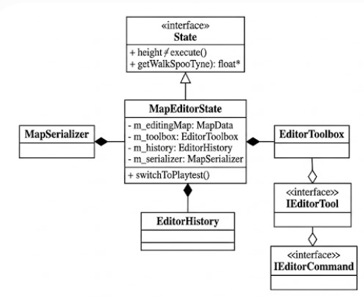
<figcaption>Proposed Architecture for In-Game Map Builder</figcaption>
</figure>

## Future Direction 2: Data-Driven Gameplay Configuration

### Functional Overview

This feature allows players or developers to directly customize runtime
gameplay parameters:

- **Hero Parameters:** Walking speed, jump force, acceleration,
  invincibility duration, special-skill cooldown, and initial life
  count.

- **Enemy Parameters:** Maximum health, patrol speed, movement range,
  and attack frequency for bosses and witches.

- **World Physics Parameters:** Global gravity, friction coefficients,
  and maximum fall speed.

- **Preset Profile System:** Provides predefined modes (*Classic*, *Moon
  Jump -- Low Gravity*, *Turbo Speedrun*, *Nightmare Hardcore*) and
  supports saving or sharing configuration profiles in JSON format.

### Evaluation of the Current Design (OOP/SOLID Perspective)

**Strengths (Reusability):**

- The separation between character states (`HeroState`) and the physics
  system (`WorldPhysicsSystem`) already encapsulates movement and
  physics calculations within dedicated components.

- The project has already integrated the `nlohmann::json` library within
  the `SaveManager`, providing an existing foundation for implementing a
  gameplay configuration parser.

- The `SettingsState` already contains a slider-based UI component
  (`VolumeSlider`), which can be reused as a basis for implementing
  parameter controls in a `CustomizationState`.

**Weaknesses and Design Challenges (OOP/SOLID):**

- **Compile-Time Configuration Coupling:** State classes such as
  `RunState` and `JumpState` directly depend on compile-time constants
  defined in `PhysicsConstants.h` (e.g., `constexpr float WALK_SPEED`,
  `JUMP_FORCE`). This tightly couples gameplay behavior to a fixed
  parameter set.

- **Limited Runtime Configurability:** Rebalancing the game or
  experimenting with alternative parameter values currently requires
  modifying the C++ source code and recompiling the application.

- **Hardcoded Gameplay Parameters:** Several enemy and physics
  parameters, such as enemy speed and gravity (`1500.f`), are directly
  embedded within components such as `EnemyFactory` and
  `WorldPhysicsSystem`.

### Proposed Architecture

- **Data-Driven Configuration System:** Moves gameplay constants into
  dedicated configuration objects (`HeroStatsConfig`,
  `EnemyStatsConfig`, `WorldPhysicsConfig`) that are dynamically loaded
  from a `config/gameplay.json` file through the `GameConfigRegistry`.

- **Provider-Based Dependency Injection:** Gameplay systems obtain
  configuration data through abstractions such as `IStatsProvider` and
  `IPhysicsConfigProvider` rather than directly accessing global or
  compile-time constants.

- **`CustomizationState`:** Provides sliders and other UI controls for
  modifying configuration values in memory before applying them to the
  active `LevelRuntime`.

<figure data-latex-placement="h">
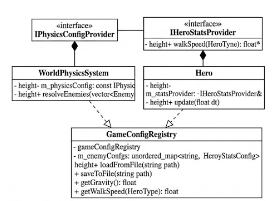
<figcaption>Proposed Architecture for Data-Driven Gameplay
Configuration</figcaption>
</figure>

# Project Demonstration

Due to the dynamic nature of the game engine, real-time mechanics, and
audio subsystems, static images cannot fully capture the gameplay
experience. Therefore, a comprehensive gameplay demonstration has been
recorded and published on YouTube to showcase the integration of our
core systems in action.

## Gameplay Walkthrough

The demonstration video covers the following key engineering and
gameplay features:

- **Initialization and Persistence:** Loading a saved game state using
  the JSON Save/Load mechanism, which accurately restores the hero's
  form, inventory, and the state of destroyed map blocks.

- **Item Mechanics and Power-Ups:** Interacting with collectible items
  such as Mushrooms and Fire Flowers to trigger multi-tier hero
  evolution forms, alongside collecting coins and hitting interactive
  `QuestionBlocks`.

- **Pipe Warp Navigation:** Utilizing pipe entrances to seamlessly
  travel between different sections of the level, demonstrating smooth
  sub-area transitions and position resets.

- **Hero Special Abilities:** Executing hero-specific special abilities
  to defeat enemies.

- **Physics and AI Interaction:** Navigating terrain using dynamic
  gravity acceleration, dual-pass AABB collision snapping, and engaging
  patrol-based AI enemies (e.g., Goombas and Koopas).

- **Multi-Phase Boss Encounter:** The climactic battle against
  **ThorKing** in Level 1-3. The sequence demonstrates spatial boundary
  locking, localized SFX playback via the `SoundManager`, and the boss's
  complex FSM state transitions.

- **Real-Time UI Integration:** The `HUDManager` interfacing with the
  `PlayingState` to dynamically display and update score, coins, lives,
  and the remaining time.

## Video Link

To view the full gameplay recording and system demonstration, please
access the link below:

::: center
<https://www.youtube.com/watch?v=3uOq83P2HQk>
:::

# Conclusion

The **Mario Game Project** successfully demonstrates the end-to-end
architectural design, mathematical modeling, and software engineering of
a fully featured 2D platformer engine developed in C++ using the SFML
multimedia framework. Inspired by the foundational mechanics of classic
side-scrolling platformers, the system integrates complex gameplay
systems---including multi-hero selection (Mario, Luigi, and Flash),
multi-tier character evolution (Small, Giant, and Tier-3 Special forms),
dynamic AABB collision kinematics, custom artificial intelligence, Tiled
map level parsing, spatial partitioning, interactive world elements, HUD
metrics, contextual audio streams, and JSON-driven game state
persistence.

## Architectural Achievements and Design Integrity

A core objective of this project was applying Object-Oriented
Programming (OOP) principles and architectural design patterns to
resolve the inherent complexity of real-time interactive software. The
application of these methodologies yielded substantial benefits across
the codebase:

- **Encapsulation and Separation of Concerns:** By strictly decoupling
  the core render loop (`GameLoop`), physics mechanics
  (`WorldPhysicsSystem`), presentation components (`HUD`,
  `SoundManager`), and world state management (`LevelRuntime`),
  individual subsystems were built and maintained independently without
  propagating collateral bug regressions.

- **Polymorphism and Behavioral Patterns:** The *State/Strategy Pattern*
  was successfully leveraged to govern hero state transitions and
  dynamic texture routing without violating the Open/Closed Principle
  (OCP). The *Factory Pattern* abstracted entity instantiation during
  map loading, allowing new blocks, items, and character classes to be
  introduced seamlessly. The *Observer Pattern* cleanly decoupled engine
  event processing from real-time HUD rendering updates, while the
  *Template Method Pattern* established reusable patrol and
  decision-making skeletons for enemy dynamic behavior hierarchies.

## Engineering Bottlenecks and Solutions

Throughout the development lifecycle, overcoming real-world technical
bottlenecks provided deep practical insight into graphics rendering,
continuous collision detection, numerical mechanics, and persistent
serialization:

- **Mathematical Origin Alignment:** Formulated an automated pixel-alpha
  Center-of-Mass (CM) padding algorithm to eliminate horizontal sprite
  jittering and state transition sliding across non-uniform character
  asset sheets.

- **Kinematic Decoupling in FSM:** Redesigned locomotion state guards by
  constructing composite input-velocity invariants, permanently
  resolving high-frequency Finite State Machine (FSM) state oscillations
  and frame-freezing defects.

- **Map-Agnostic Dynamic Physics:** Replaced fragile hardcoded ground
  assumptions with continuous dynamic gravity acceleration and dual-pass
  AABB spatial snapping within `World­Physics­System`, ensuring robust
  interaction across arbitrary topographies.

- **State Serialization Pipeline:** Architected a deterministic
  base-reload and JSON overlay mechanism in `SaveManager`, successfully
  preserving dynamic entity states, damaged block topologies, player
  progress metrics, and invulnerability timers.

- **Dynamic Spatial Partitioning:** Implemented context-aware
  `PlayableRegion` bounding zones that dynamically clamp camera
  viewports, eliminate visual border bleeding, adjust underground
  kill-planes, and switch environmental theme palettes and audio tracks
  seamlessly.

## Team Synergy and Technical Growth

The successful completion of the project is attributed to structured
collaboration and a clear division of responsibilities among all four
team members---spanning Core Engine & Physics (Tran Minh Khoa), Hero &
Item Mechanics (Tran Nhu Khai), Enemy AI Subsystems (Do Viet Hoang
Long), and Level Parsing, UI/UX & Audio (Tran Dang Khoa). Cooperative
version control via Git, structured peer code reviews, and continuous
integration testing ensured overall system stability and code
consistency throughout the development cycle.

In summary, the Mario Game Project stands as a robust, highly
extensible, and production-ready C++ software system. Beyond delivering
a smooth and interactive gameplay experience, the project successfully
bridged theoretical computer science principles---such as OOP design
patterns, state machines, numerical physics simulation, and spatial
partitioning---with practical, real-world software architecture.
