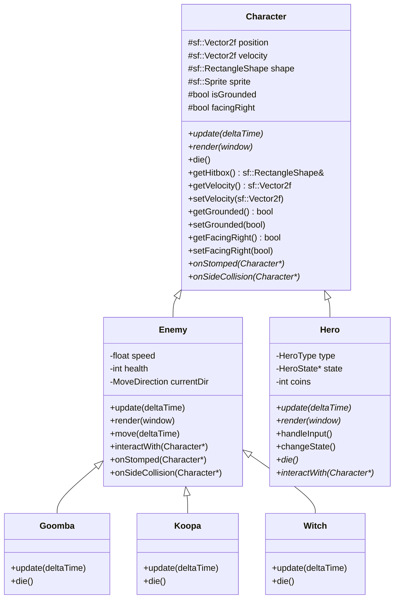

# Paragraph Character

```mermaid
classDiagram
    class Character {
        #sf::Vector2f position
        #sf::Vector2f velocity
        #sf::RectangleShape shape
        #sf::Sprite sprite
        #bool isGrounded
        #bool facingRight
        +update(deltaTime)*
        +render(window)*
        +die()
        +getHitbox() sf::RectangleShape&
        +getVelocity() sf::Vector2f
        +setVelocity(sf::Vector2f)
        +getGrounded() bool
        +setGrounded(bool)
        +getFacingRight() bool
        +setFacingRight(bool)
        +onStomped(Character*)*
        +onSideCollision(Character*)*
    }

    class Enemy {
        -float speed
        -int health
        -MoveDirection currentDir
        +update(deltaTime)
        +render(window)
        +move(deltaTime)
        +interactWith(Character*)
        +onStomped(Character*)
        +onSideCollision(Character*)
    }

    class Goomba {
        +update(deltaTime)
        +die()
    }
    
    class Koopa {
        +update(deltaTime)
        +die()
    }

    class Witch {
        +update(deltaTime)
        +die()
    }

    class Hero {
        -HeroType type
        -HeroState* state
        -int coins
        +update(deltaTime)*
        +render(window)*
        +handleInput()
        +changeState()
        +die()*
        +interactWith(Character*)*
    }

    Character <|-- Enemy
    Enemy <|-- Goomba
    Enemy <|-- Koopa
    Enemy <|-- Witch
    
    Character <|-- Hero
```